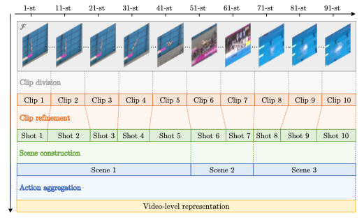
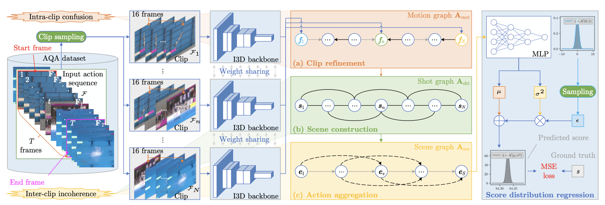
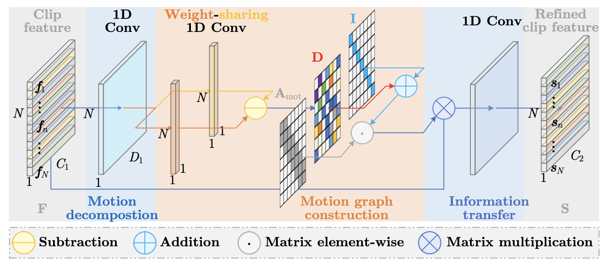

# 图卷积神经网络 GCN

## 2023: Hierarchical Graph Convolutional Networks
> 层级卷积神经网络

### 1 Abstract

- 当前工作存在的问题：将 video 划分为等长的 clip，可能会导致两种问题

    - intra-clip confusion

    - inter-clip incoherence

- 本文创新点：HGC

    - 通过 clip refinement（切片细化）来纠正语义信息内的混乱，生成 `shot` 作为基本动作单元

        > 解决了 intra-clip confusion 问题

    - 构建 scene graph：将连续的一组 `shot` 组合成有意义的 `scene`，从而捕捉 `local dynamics`

        > - `scene` 可以被视为给定动作的另一种 “过程描述”
        > - 解决了 inter-clip incoherence 问题

    - 通过顺序聚合 scenes 获取 video-level representation，最终通过回归预测得到分数

    - 验证数据集：AQA-7，MTL-AQA，JIGSAWS
  
### 2 Relative Works

#### 2.1 AQA 

##### 主要流派

1. Pose-Based（早期）：使用 pose-based feature 回归预测分数

    - 常见 pipeline：`location tracking -- 特征提取 -- 分数预测`

    - 优势：可以提取 position / speed / direction 等可具体量化的特征

    - 劣势

        - 在体育运动领域进行姿态估计比较困难：蹲伏/遮挡的存在会导致错估和缺失

        - 未考虑“水花”等 “视觉（环境）” 因素

    - Sample

        - Pirsiavash
            
            - 估计 pose -> 使用 discrete cosine transform 编码 -> SVR 回归预测

            - 由于 照明、视角变换、遮挡 的存在，估计的 pose 并不准确

1. Vision-Based `State-of-the-Art` !!!

    > make FULL use of the visual features

    - 常见 pipeline：`特征提取 -- 特征聚合 -- 回归预测`

    - 常用特征提取 backbone: I3D / C3D

        但这些 3D-CNN 对于内存和计算资源占用极大，只能应用于短小的 clip

    - 因为整个动作序列对于分数都有意义，所以 “动作识别” 用的 “关键帧抽取” 技术在 AQA 问题上不太适用
  
---
!!! info "是否使用 `对比学习` 思想"

此外，也可以按照 Input-Format 进行划分:

- Exampler-Free

- Exampler-Based (类 CoRE)

    - 优势：通过仅回归计算 relative score，提升了准确度

    - 劣势：

        - 人工选取 sampler 会引入 personal bias（但是应该可以随机抽样？）
  
        - 对于 exampler 进行 feature learning 会引入额外的计算成本

---

按照 Output-Fomat 划分：

- Quality Score Regression：预测准确的分数值（输出是 `float`）

- Grading：输出评级标签（如 `A-E` 档，或者 `Good/Bad` 二分类）

- Pairwise-Sorting：输出 quality score，并提供 rank-coefficient 进行评估

##### Trade off

> Sequence Length x Visual Cues

大部分工作：

- 将视频划分为等长的 clip（16 frames）

- 对每个 clip *独立计算* spatial-temporal features

- 生成 video-level feature：使用平均池化

以上方案的缺点：

- 等长切割对于可能导致每个 clip 中蕴含的 motion-related 语义信息存在 缺失/冗余

- 一个有效的评分周期往往横跨多个基本动作单元（单个 unit 往往不能看到全局信息）

##### Aggregation Methods

- 常见方法如 Average Pooling，LSTM 无法准确的捕捉 local & global dynamics

- 为了更合理的对 clip 进行划分，boundary detection (of basic motion units) 将作为预训练任务

    - 但是 过度切分/错误切分 仍然会导致重要时序信息的缺失

    - 此外，边界划分需要的 **人工标签** 数据集基本不给（手标的成本又很高）
  
- 受 Structured Video Analysis 的启发，本文提出了一种层级结构
    
    - `shot` - basic action unit，包含若干帧
    - `scene` - 包含若干 *连续的* `shots`
    - `action` - 包含若干 `scenes`

#### 2.2 Video Representation Learning

> 为下游任务提供 Spatial-Temporal Features，从而进行 回归/分类

##### 2.2.1 Key Points（早期）

早期方法:

- 首先识别得到 key points（关键点），再从这些关键点中提取抽象度更高的 feature。

    常见方法有：space-time interest points，dense trajectories

- 随后通过 BoW / Fisher Vector 等编码方式，将特征聚合得到 video-level representation

!!!bug "这些方法不能 *完整* 识别 discriminative features"
    基于骨架的方法会忽略 subtle diffs，这也是 AQA 前期发展缓慢的重要原因

##### 2.2.2 Deep Learning-Based
> 性能更好捏

- 最普遍且有效提取 Spatial-Temporal feature 的方法是 3D-CNNs

- 但由于 3D-CNN 计算成本巨大，不能处理 100 frames 以上的长视频片段

    AQA 往往先识别 clip-level 特征（再考虑聚合）

#### 2.3 Structured Video Analysis

!!! question "WHY structured?"
    - Raw Video 是 非结构化(unstructured) 数据 => 就是 frame stream
    - 如果要实现 content-based video processing，就需要考虑将其结构化

- Hierarchical Video Stucture 层级视频结构

    - `shots` 由连续的 frames 组成

        - 通过 shot boundary detection methods 进行划分

        - 主要 visual content 由 key-frame 进行表示

    - `groups` 由 similiar shots 构成

    - `scenes` 由 semantically-related shots 构成

- 本文认为： 

    - <u>shots</u> 是 basci motion unit，并且相互独立

    - 区别于 Wang 等人于 2013 年提出的 latent hierachical model

        > 自动将复杂动作划分为 sub-activitied，使用 SVM 结局 Action Classification 问题

        本文使用 GCN 构建深层 hierarchical model，从而解决 AQA 问题

### 3 Approach

#### 3.1 Clip 特征提取

- Input 表示

    - 假设视频共有 $T$ 帧，则可将输入记为 $\mathcal{F} = \{X_1,X_2, ..., X_T\}$

    - 假设单帧的像素为 $W \times H$，则第 $t$ 帧可以记为 tensor: $X_t \in \mathbb{R}^{W\times H \times 3}$

- Clip 划分

    将 $\mathcal{F}$ 划分为 16-frames / each 的 $N$ \* clips，我们将 clip 序列记为 $\mathcal{F}_1, \mathcal{F}_2, ..., \mathcal{F}_N$

- Featrue Extraction

    使用 weight-sharing 的 I3D backbone 对每一个 clip 进行特征提取，得到 $f_1, f_2, ...,f_N \in \mathbb{R}^{C_1}$

    > 其中 $C_1$ 表示 feature demesion

    => 把这一坨 feature 拼合，即可得到特征矩阵 $\mathbf{F} \in \mathbb{R}^{N \times C_1}$

#### 3.2 HGCN Modules

##### Clip Refinement
> 因为等距划分过于草率，这一模块通过左右调整 boundary 使得 each clip 具有完备的语义信息

下面是两种可能的草率划分情形：

1. 当前 clip 包含的语义信息不完整：可能需要从 前/后 的 clip 挪用一些
2. 当前 clip 包含了 $\lt$ 1 motion：需要分给 前/后 的 clip

!!! info "Feature of Action"
    假设 action feature 可以由一组正交坐标 $b_1,b_2, ... , b_B \in \mathbb{R}^{D_1}$ 表示（$D_1$ 是 embedding dimension）

!!! note "Clip Refinement Module"
    

    - 方案：先通过 Motion Decomposition 找出动作间 transition 发生的位置，再对 clip 进行均贫富处理
  
    - 结果：从 clip feature $\mathbf{F}$ 生成 shot feature $\mathbf{S}$
 
###### 1 Motion Decomposition

在这一步中，我们需要将抽取的特征 $f_i$ 映射到 "潜在流形空间 latent manifold space" ，有：

$$
m_i = \lambda_i^1 b_1 + \lambda_i^2 b_2 + ... + \lambda_i^B b_B
$$

> 其中 $\{\lambda_i^j\}$ 是一组用于描述 action freature 的正交坐标

这一操作可以通过 NN 实现，记为以下形式：

$$
m_i = ReLU(Conv1D_{group}(f_i,g))
$$

- $Conv1D_{group}(f,g)$ 是 `groupSize = g`，`kernelSize=1` 的 1D-Conv 操作

    > 各 clip 共享相同权重的 1D-Conv

- 选择 ReLU 是因为计算更高效

!!! comment "Convenience"
    通过比较 $m_i, m_j$ 对应的系数 $\lambda_i^x, \lambda_j^x$，我们可以方便的计算任意两个 clip 之间的 direction & magnitude

###### 2 Motion Graph Construction

我们将有向图 Motion Graph 记为 $\mathcal{G}_{mot} = (\mathcal{V}_{mot},\mathcal{E}_{mot})$

- $\left|\mathcal{V}_{mot}\right|$ 是 motion nodes 构成的点集
- $\left|\mathcal{E}_{mot}\right|$ 是有向边，使用邻接矩阵 $\mathbf{A}_{mot} \in \mathbb{R}^{N \times N}$ 表示

---

由于 information transfer 可能在连续的 $r$ 个 clip 间进行，我们可以将 $\mathbf{A}_{mot}$ 记为：

$$
A_{mot}^{ij} = 
\left\{
    \begin{align*}
        &1,\text{ if } \|i-j\| \lt r \\
        &0, \text{ otherwise }
    \end{align*}
\right.
$$

可以看成一个 `length=r` 的滑动窗口遮罩

---
!!! question "如何决定 frames 移动的 direction (前/后) & magnitude (具体移动多少个 clip)？"

- 学习距离函数 $d_{ij}$ 来衡量 $(m_i, m_j)$ 之间的距离（主要就是学参数矩阵 $\mathbf{W}_{mot} \in \mathbb{R}^{D_1 \times 1}$

    $$
        d_{ij} = \tanh((m_i - m_j) \cdot \mathbf{W}_{mot}) \in [-1,1]
    $$

    - $sign(d_{ij})$ 表示 transfer 发生的方向（前/后/不变）

        - $sign(d_{ij}) \lt 0$ 表示 clip-i 需要从 clip-j 接收数量为 $\|d_i{j}\|$ 的 feature（此时 transition 发生在 clip-i 内）

        - $sign(d_{ij}) == 0$ 表示边界不需要移动

    - $\|d_i{j}\|$ 表示 transfer 的梯度（具体横跨几个 clip）

###### 3 Information Transfer

这里使用一个 GCN Layer 完成 $(f_i,f_j)$ 之间的 transfer，得到 shot feature $s_i \in \mathbb{R}^{C_2}$：

$$
s_i = ReLU\left(
    f_i \mathbf{W}_{tra} + \sum_{j \in \mathcal{N}_i} B_{mot}^{ij}\ f_j\ \mathbf{U}_{tra}
\right)
$$

- 其中：$B_{mot}^{ij} = A_{mot}^{ij} \cdot d_{ij}$，$\mathbf{W}_{tra}, \mathbf{U}_{tra} \in \mathbb{R}^{C_1 \times C_2}$，$\mathcal{N}_i$ 是 clip-i 的邻域（前后 $r$ 个）
  
###### 4 Sequential Property

- 先前的工作证明：Encoder 可以有效的将 raw data 映射到 motion manifold

- 但是 seperate clip encoding 不能保留 sequential property

    => 相邻 clip 之间的距离很小，而不相邻 clip 之间的 clip 较大

- 常用的 Laplace 正则化考虑了 时空 上的 closeness，但这在本文中不太适用

    => 提出了 clip-level closeness 的度量 $O$：

    $$
    \begin{align*}
    O &= \mathop{\min}_h \sum+{i=1}^N \sum_{j=1}^N A_{mot}^{ij} \|h_i - h_j\|_2^2\\
    &= \mathop{\min}_H \text{tr}(\mathbf{HLH}^T)
    \end{align*}
    $$

    - $h_i \in \mathbb{R}^{C_2}$ 是 clip feature ($f_i$) emedding 后的结果
    - $\mathbf{H} \in \mathbb{R}^{N \times C_2}$ 是 $\{h_i\}$ 形成的矩阵，$\mathbf{L} \in \mathbb{R}^{N \times N}$ 是 $A_{mot}$ 的拉普拉斯矩阵

    !!! info "Theorem"
        当 $H = FW$ 时，GCN 的传播过程 $\Leftrightarrow$ 优化上述的 clip-level 正则化表达式

##### Scene Construction
> 旨在将连续的几个 shots 组合成一个 meaningful scene

- 本文同样认为同一类的 Video 由固定的 Action Procedures 构成，比如 跳水 = 起跳 -> 翻滚 -> 入水

- 而 本模块 可以捕捉各个 procedure 的所有 subtle diff，从而准确的对细节进行评估

1. Shot Graph Construction

    - 与 Motion-Graph 类似，可以将 Shot Graph 视作 点集 + 边集 只和，记为：

        $$
        \mathcal{G}_{sht} = (\mathcal{V}_{sht},\mathcal{E}_{sht})
        $$

        > 但不同于 Motion Graph 量化不同 shot 之间的 diffrerence，Shot Graph 旨在寻找同一 scene 中各个 shot 之间的 similarity

    - 类似的，设置 `neighborhoodSize = K`，可以得到控制 $s_i,s_j$ 之间 connection 的邻接矩阵 $A_{sht}^{ij}$

    - 我们假设：<u>属于同一 scene 的各 shots 之间的连接更加紧密</u>

        显然，0-1 邻接矩阵 $A_{sht}^{ij}$ 无法对此进行衡量

        为此，作者提出了使用 self-attention 的可学习邻接矩阵 $B_{ij}$ 对 $s_i,s_j$ 之间的邻接紧密性进行量化：

        $$
        B_{sht}^{ij} = \text{softmax}\left(
            \frac{(s_iW_1) \cdot (s_jW_2)^T}{\sqrt{D_2}}
        \right)
        $$

2. Shot Graph Aggregation

    这也可以用一个 GCN Layer 实现：

    $$
    s'_i = ReLU(s_iW_{sht} + \sum_{j\in \mathcal{N}_i} A_{adp}^{ij}\ s_j\ U_{sht})
    $$

    其中 $A_{adp}^{ij}$ 视情况选择 $A_{sht} \odot B_{sht}$ 或 $A_{sht} + B_{sht}$

3. Shot Reduction

    尽管跳水比赛都有相同的 procedure 序列，但各 procedure 可能包含不同的 shots

    => 为此，文章通过 GCN Layer 学习矩阵 $T$ 实现 $N*shots \rightarrow S*scenes$ 的 映射

    $$
    T = \text{softmax}(\oplus_{i=1}^N A_{adp}\ \sum_{j=1}^N\ s'_j\ W_{tft})
    $$

---

最后我们可以得到 scenes 的表示：

$$
E = S'T
$$

其中 $E$ 是 $S$ 个 scenes $\{e_i\}$ 拼接得到的，$S'$ 是更新后的 shot feature $\{s'_i\}$ 拼接得到的

##### Action Aggregation
> 用于捕捉一些 global dynamics，用于衡量总体表现

由于动作只能从 i 单向过渡到 i+1（不能反过来）

=> 我们需要学习各个 procedure 之间的依赖关系，并最终聚合得到 video-level representation

1. Scene Graphp Construction

    $$
    \mathcal{G}_{sce} = (\mathcal{V}_{sce},\mathcal{E}_{sce})
    $$

    为了控制信息严格 **前 $\rightarrow$ 后** 流动，此处 `A_sce[i][j] = (i-j > 0) ? 1 : 0`

    因为此处同样需要连接的 方向 & 梯度，所以也需要学习 adaptive weight:

    $$
    B_{sce}^{ij} = \text{softmax}\left(\frac{(e_i\ U_1)\cdot(e_j\ U_2)^T}{\sqrt{D_3}}\right)
    $$

2. Video-level Aggregation

    还是使用 GCN Layer 实现：

    $$
    e'_i = ReLU(e_i\ W_{act} + \sum_{j\in \mathcal{{N}_i}}(A_{sce} \cdot B_{sce})\ e_j\ U_{act})
    $$

    更新后的 secene feature $\{e'_i\}$ 将作为最后用于回归的 video-level representation

#### 3.3 Score Regression
> 并不是直接回归，从而降低评委主观因素的影响

- 降低评委主观因素影响的常见方法是 uncertainty-aware score distribution learning

    主要思路是学习一个分数分布，使得两个不同 action 之间的得分具有较大差异

- 相似的，本文认为最终的分数是一个 random variable，并对其分数分布概率函数进行学习

---

对于 video-level representation $v (e')$:

1. 使用 Probabilistic Encoder $\mathbb{R}^{C_4} \rightarrow \mathbb{R}$ 将其映射为 random score variable $s$

2. 变量 $s$ 应当服从高斯分布，即：

    $$
        p(s;v) = \frac{1}{\sqrt{2\pi\sigma^2(v)}} \exp(- \frac{(s-\mu(v))^2}{2\sigma^2(v)})
    $$

    其中 $\mu$ 对应均值，$\sigma$ 对应标准差

3. Sample $\varepsilon$ from 标准分布 $\mathcal{N}(0,1)$，从而确保 encoder 的训练过程的可行性

    > 这样一来 score distribution sampling 过程就是 可微的(differentiable)

4. 基于随机独立采样变量 $\varepsilon$、均值 $\mu(v)$ 与 标准差 $\sigma(v)$ 计算最终的预测结果 $\hat{s}$ 

    $$
    \hat{s} = \mu(v) + \varepsilon \cdot \sigma(v)
    $$

#### 3.4 Loss Function

对于 score distribution regression 过程，使用 MSE Loss 进行评估：

$$
\mathcal{L}_{MSE} = \frac{1}{N} \sum_{i=1}^N (s_i - \hat{s}_i)^2
$$