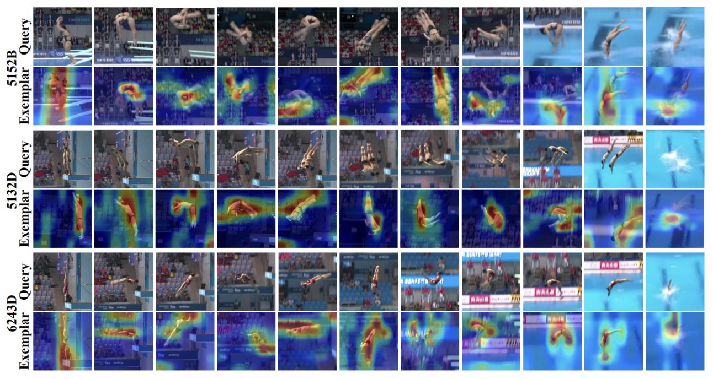
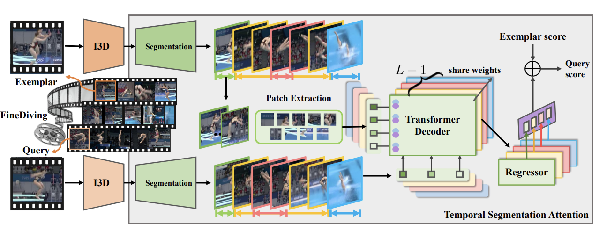

# 狠狠切割

## 2018: S3D

> Stacking Segmental P3D for Action Quality Assessment

!!! info "首个 Stage by Stage 评分的方法"

### 1 Abstract

- 先前的工作

    - C3D (Convolutional 3D Network)
  
        - 优势：可以同时捕捉 appearance & subtle motion cues
        - 缺点：训练消耗会消耗较多内存，只能处理等帧切割的 clip

    - 更多工作将 C3D 分解为 “两步走”：
  
        1. 在图像上训练的 2D-CNN（ResNet）
        2. 基于 2D feature 生成时序特征的 1D-CNN（LSTM）

        > 但除了 Two-stream 外的方法无法捕捉 motion cue

    - 信号处理领域的研究表明，一个 filter 往往可以由若干更简单的 filter 相乘得到

        P3D 和 I3D 工作已经证明在大规模数据集(Kinetics)上训练的3D卷积可被隐式分解

        => 但我们很难解释具体是哪一个部分起到了关键作用

- 本文工作

    - 基于 ED-TCN，提出了 Segment-based P3D-fused Network (S3D)

        对于每个 segment 分别应用 P3D，再进行 aggregation

    - 证明 segment-aware 的训练方式强于 full-video 训练

        发现 full-video P3D 和只观察 “水花” 的结果类似（但没有关注入水前的动作序列）
        
    - 证明 temporal segmentation 可以以较小的代价完成
    - benchmark: UNLV-Dive

### 2 Related Works

#### Diving Skill Assessment

- 早期有使用 approximate entropy features 的工作
- Pose + SVR on MIT-Diving
- C3D + SVR on UNLV-Dive

#### 3D-CNN & STN

- 3D-CNN

    - 3D-CNN 并不是特别为了视频分析任务设计的（patch-level 3D-CNN 是医学图像分析的重要手段）

        事实上，3D-CNN 是 STN 的替代品（毕竟时间和空间存在本质上的不同）

    - 在预设帧数视频上训练的 3D-CNN 要求输入也有同样的帧数（每个 clip 都得是 16-frame）

        小的 clipSize 一是出于内存占用的考虑，同时也保证了特征的 locality

    - 和捕获 spatial local connectivity 的 2D-CNN 相比，3D-CNN 天然支持对 temporally local motion and coherence 的捕捉

- TCN: 在 segmenting fine-grained actions 上具备 SOTA 表现

    - TCN 实际上是 2D-CNN + LSTM 的简化版本 —— 在 2D-CNN 的倒数第二层上构建 cross-frame 的 1D-CNN
    
        其输入是由 2D-CNN 逐帧提取的一维特征

    - Encoder-Decoder TCN (ED-TCN) 通过 下采样-上采样 实现 Encode-Decode，随后通过 `softmax` 为每一帧预测动作类型标签

### 3 Approach

!!! info "Diving Video Segmentation"
    作者认为 Diving 视频可以划分为 5 个片段：

    > 实际需要评分的只有 2-5 (4个片段)

    1. Preparation（不评分）
    2. Jumping: 离开跳台 -> 手第一次碰到身体
    3. Dropping: 手第一次碰到身体 -> 手最后一次离开身体
    4. Entering into the water
    5. Water-spray decaying: 水花逐渐消失

#### 1 full-video P3D

- 改装 P3D

    - 原装的 P3D 适用于 action classification 任务，但同时考虑了 appearance & local motion

    - 为了完成适配 regression 任务，作者把最后一层换成了 Fully-Connected + Dropout

- 拉踩 C3D

    - C3D 的 `3 * 3 * 3` kernel size 是硬性要求，训练成本大
    - P3D 的 `3 * 3 * 3` kernel 是 **可拆分的**，可以看成 `3*3*1 + 1*1*3` 的简单 kernel 组合

        这同时允许网络独立进行 2D-Conv 和 1D-Conv

    - 与 ResNet 的思想类似，P3D 允许将这些卷积层做成 residual units，根据 2D($S(·)$)-1D($T(·)$) 的混合策略不同，可以讲单元划分为三种：
  
        1. P3D-serial: $x_{t+1} = x_t + T(S(x_t))$
        2. P3D-parallel: $x_{t+1} = x_t + T(x_t) + S(x_t)$
        3. P3D-composition: $x_{t+1} = x_t + T(S(x_t)) + S(x_t)$

        其中 $x_t, x_{t+1}$ 分别是 x-th 单元的输入输出

    - P3D 还采用了 bottleneck 的设计：在每个 residual units 前后加上 `1*1*1 Conv`，分别用于 降低输入纬度 & 增长输出纬度
  
#### 2 Segment-level P3D

!!! question "预训练的 P3D 模型只能处理 16-frame 输入，我们应该怎么对 segment 提取特征呢？"
    只要在每个 segment center-frame 的左右 16-frame 提取特征就好啦

- 我们能够 independently 的对每一个 stage 进行特征提取/分数预测：

    - use features: 取 $Avg$ => single feature

    - use subscores: 合并所有 subscores => feature vec `[s1, s2, ..., sn]`

- 通过上面的方法，我们可以获得 segmentation+P3D 处理后的 feature set $x$

    加上整个视频的 ground-truth label $y$，我们可以得到一个 training-sample $(x,y)$

- 最终训练一个 LR(逻辑回归) / SVR 模型进行分数的回归预测

#### 3 Teomporal Segmentation using TCN

- 此处的 Temporal Segmentation 其实可以视为一个 *逐帧五分类* 任务

    同时需要保证 intra-class continuity（每个阶段是连续的）

- 输入：frame-level 2D-CNN feature

    - 假设输入视频共有 $K$ 帧，2D-CNN 的输出纬度为 $D$，我们可以将 2D-CNN 提取的特征表示为 $X_0 \in \mathbb{R}^{D \times K}$

    - 此时每一层 TCN 的输入可以被记为 $X_i(i \geq 0)$

- 输出：5 segments

- ED-TCN: 我们可以讲 l-th Layer 的 temporalConv 过程记为以下形式

    $$
    X_l = \text{Activate}(W_l * X_{l-1} + b)\\
    $$

    $$
    X_l \in \mathbb{R}^{N_l \times T_l},\ W_l \in \mathbb{R}^{d_l \times N_{l-1}},\ b \in \mathbb{R}^{N_l}
    $$

    - 初始条件为 $(N_0, T_0) = (D,K)$
    - $N_l$ 是 l-th Layer 中的 `n_Conv_Filters`，$T_l$ 是 `len(feature)`，$d_l$ 是 l-th Layer 的 `len(filter)`

## 2022 [TSA: Temporal Segmentation Attention](https://arxiv.org/pdf/2204.03646.pdf)

### Neo Dataset: [FineDiving](https://github.com/xujinglin/FineDiving)

!!! info "FineDiving是AQA任务的第一个细粒度体育视频数据集，填补了AQA中细粒度注释的空白。"

FineDiving数据集包括3000个视频样本，涵盖52种动作类型、29种子动作类型和23种难度等级类型

含两级注释：

- 动作级别标签描述了运动员的动作类型；步骤级别标签描述了程序中连续步骤的子动作类型。

    每个动作过程中相邻的步骤属于不同的子动作类型，而子动作类型的组合产生了一个动作类型。
    
    例如，对于动作类型“5255B”，属于“后仰”、“2.5仰式翻筋”和“2.5扭转”的步骤是依次执行的。

- 在时间结构中

    - 动作级别标签确定了运动员执行完整动作实例的**时间边界**

    - 步骤级别标签是动作过程中连续步骤的起始帧
  
        例如，对于类型为“5152B”的动作，连续步骤的起始帧分别为18930、18943、18957、18967和18978

### Approach

- 对于给定的输入对 $<X, V_{example}>$，最终预测得分 $\hat{S_x}$ 为：

    $$
    \hat{S_x} = TSA(I3D(X,V))_{\Theta} + S_Z
    $$

- 使用 I3D 作为特征提取的 backbone

#### 1) Procedure Segmentation

通过 segmentation component $\mathcal{S}$ 预测在 tth frame 上发生动作转变的概率（不是分类任务）

- 假设有 $L$ 次 transition（共有 $L+1$ 个阶段）

- 输出 $\mathcal{S}(I3D(X)) = [p_1, p_2, ..., p_L]$，其中 $p_k(t)$ 是第 k 次转变发生在 t 帧的概率
- 预测第 k 次转变发生的编号为：$\hat{t}_k = \mathop{argMax}\limits_{T(k-1)/L \lt k \leq Tk/L}(p_k(t))$

    约束确保了预测的转变是有序的，即 $t_1 \leq · · · \leq t_L$。

---

segmentation component $\mathcal{S}$ 包含了两个 block：

1. down-up $b_1$:

    - 由四个“down-m-up-n”子块组成，其中m和n分别表示沿空间和时间轴的输出的指定维度; 每个子块包含两个连续的卷积层和一个最大池化层。
    
    - $b_1$ 通过沿时间轴使用卷积层增加I3D特征 $I3D(X)$ 的长度，并通过沿空间轴使用最大池化层减少 $I3D(X)$ 的维度
  
        推进了深层的视觉特征 $I3D(X)$ ，以包含更深层次的空间和更长的时间视图，用于过程分割。

1. linear $b_2$

    进一步对 $b_1$ 的输出进行编码，生成动作过程中L个步骤转变的L个概率分布 $\{p_k\}^L_{k=1}$。
    
#### 2) procedure-aware cross-attention learning

通过 Transformer 的 Seq2Seq 能力学习 procedure-aware embedding of pairwise query and exemplar steps via cross-attention

- 将划分后的 $L+1$ 个 steps 记为 $\{S_l^X, S_l^Z\}_{l=1}^{L+1}$

- 通过 down-sampling 对齐 $S_l^X, S_l^Z$ 的长度

#### 3) fine-grained contrastive regression

!!! info "每个 step 有单独的 regressor"

基于学习到的过程感知嵌入$S_l$，我们通过学习成对步骤的相对分数来量化查询和示例之间的步骤偏差，从而指导TSA模块通过学习细粒度对比回归组件R来评估动作质量：

$$\hat{y}_X = \frac{1}{L+1} \sum_{l=1}^{L+1} R(S_l) + y_Z \tag{7}$$

其中$y_Z$是来自训练集的示例分数标签。

!!! info "Vote"
    在测试过程中，对于测试视频$X_{\text{test}}$，我们采用多示例投票策略从训练集中选择M个示例，然后构建M个视频对$\{(X_{\text{test}}, Z_j)\}_{j=1}^M$

    记示例分数标签为$\{y_{Zj}\}_{j=1}^M$，多示例投票的过程可以表示为：

    $$\hat{y}_{X_{\text{test}}} = \frac{1}{M} \sum_{j=1}^{M} \left(P(X_{\text{test}}, Z_j | \Theta) + y_{Zj}\right).$$

## 2023 IRIS

!!! info "本文聚焦的问题：(花滑)单人短节目"
    - 节目时长约为 3min

    - 相比于自由滑，节目编排受制于更多的规则

### 1 Abstract

- 创新点

    > XAI 开发者应该学习 <u>具体应用场景（运动）的评分标准(rubrics)</u>

    本文提出的 Interpretable Rubric- Informed Segmentation：

    - 其给出评分的过程是 **可解释** 的，依照 rubric 决定 what to consider

        使用 4 个 key feature 进行 预测&解释: Score, Sequence, Segments, and Subscores

    - 对输入进行分割，以定位对应特定 criteria 的特殊 section

    - 本文仅对 *figure skating* 进行测定，但方法同样适用于其他 Video-based AQA 问题

### 2 Relative Works

1. Action Quality Assessment

    目前已经有许多针对 Sport 及其他领域的 AQA AI 解决方案被提出，通过训练一个 Regression Model 对最终分数进行预测。
    
    - 这些方法往往通过 3D CNN (C3D / I3D) 进行特征提取 —— 通过在 2D(spatial) & 1D(temporal) 进行卷积，将**较短的**视频切片转换为 feature vector

    - 为了处理**更长的**输入视频：

        - Parmar 将 3DCNN 和 LSTM 结合，提出了 C3D-LSTM

        - Zheng 基于 Graph Convolutional Network 提出了 Context-aware 的模型
        
            对 Static Posture & Dynamic Movement 进行建模来捕捉不同时间跨度上的联系

        - Nekoui 提出了一种 CNN-based 的方法同时对粗细粒度的 temporal dependencies 进行捕捉
        
            使用 video feature & pose estimation heatmap，并堆叠不同 kernel size 的 CNN 模块来捕捉不同时间跨度的 pattern 进行捕捉

        - Xu 针对 *figure skating* 场景提出了 multi-scale and skip-connected CNN-LSTM
        
            通过不同大小的 CNN kernel 对短期 temporal dependencies 进行捕捉 & 通过 LSTM + self-attention 对长期 temporal dependencies 进行捕捉

2. Explaining Action Quality Assessment

    虽然上述方法卷赢了准确性（预测结果和裁判评分之间的 Spearman’s rank correlation），但却忽略了用户应该如何应用和解释这些预测结果

    > 老师 chua 的一下给你的卷子批了个总评分，又不告诉你扣哪了

    - Yu 通过 Grad-CAM saliency maps 对 *diving* 问题的评分过程进行解释
    
        => 但 saliency maps 的本意是拿来 debug 的 orz

    - Pirsiavash 通过计算 由姿态估计得到的 relative score 的梯度 来对 *diving* 问题的评分过程进行解释

        => 基于数据（而非基于人类裁判如何做出裁决）

    - 使用数据传感器 + 浅层模型的方法

        - Khan 借鉴了电子板球游戏，使用可穿戴设备收集数据并对板球击球数据进行分析，并人为规定了若干 low-level sub-actions

        - Thompson 在量化评分标准后，提出了对 “盛装舞步” 项目的可视化方法

3. Rubrics for Figure Skating

    - “评分标准” 的两要素：

        1. $\geq 1$ * trait / dimension + 对应的解释案例

        2. 各 dimension 的 评分范围 / 分段标准

    - ISU Judging System: 对每个维度给 sub-score，最后折算总分

        1. TES（技术得分）

            运动员的技术动作序列将被提前列出，每个动作的得分 = Base Value(难度分) + GOE(偏差值)

            > $GOE \in [-5,5]$

            - 动作序列将由：Jump, Spin, Step Seq 及之间的过渡动作组成

            - Jump 可被分为六种：Toe Loop (T), Salchow (S), Loop (Lo), Flip (F), Lutz (Lz), and Axel (A)

                根据起跳、落冰动作进行区分，不同的圈数会给不同的分

            - Rotation 可被分为三种：Upright (USp), Sit (SSp), and Camel (CSp)

                根据难度、流畅度、稳定度进行评分

            - Step Sequence 可被分为三种：Straight line step sequence (SISt), Circular step sequence (CiSt), and Serpentine step sequence (SeSt)

                步伐必须与音乐相匹配，并且干净利落的完成shuo ta

        2. PCS (Program Component Score) 由五部分组成：

            - Skating Skills: 对节目内容的丰富程度、技术是否干净、滑速进行评分
            
            - Tran- sition / Linking Footwork: 对整体步法和姿态转变流畅度进行评分
            
            - Performance / Execution: 是否从肢体动作和情绪上传达了配乐的情感

            - Choreography / Composition: 节目动作编排是否与音乐契合
            
            - Interpretation: 用于表达音乐的动作是否具有创新性

### 3 Approach

??? info "事前可解释性建模 Ante-hoc"
    > IRIS 在对模型进行训练前，将可解释性结合到模型结构中，以实现模型内置的可解释性

    - It is informed by a rubric to determine what to consider when calculating its judgement.

    - It performs seg- mentation to specify moments of a performance to judge specific criteria.

IRIS 使用了 4 个 Rubric-Feature 以预测和解释其作出的判断：

1. Score: Final Judgement

2. Sequence: 描述了用于评判的动作 (technical elements)

3. Segments: 每个动作由哪一条规则评判

4. Subscores: 描述 TES & PCS 各项得分

#### 0 Data Preparation
> 使用 MIT-Skate 数据集

- 将 3min 左右的视频转化为 4D tensor: `[x, y, time, colorChannel]`

- 提取 ISU 发布的 PDF 文件中的 skater name, TES base, GOE, total subscores, PCS subscore。将其与视频数据相对应。

- 手动 标记每个动作的起止时间 （train segmentation）

- 为了确保每个类别下的都有充足的数据，这里队 Jump, Spin, Step Sequence, Transition 的划分较为宽泛

    > 建议 Future Work 能够用更多数据来划分 more specific labels

#### 1 Base Embedding
> 生成 video 的 vector presentation

训练 3D-CNN（I3D） 模型 $M_0$：

- 输入: video tensor $x$

- 输出: timeseries embedding $\hat{z}_t$: 2D tensor

    $M_0$ 会对每 0.534s 生成一个 vector embedding，每个视频将对应约 356 个（zero-padding）

#### 2 Action Segments

- 训练 multi-stage temporal convolutional network (MS-TCN) $M_t$：

    - 训练集：人工标注的 segments 作为 ground truth (监督学习)

    - 输入：$\hat{z}_t$

    - 输出：action sequence embedding $\hat{z}_{\tau}$ (Seq-to-Seq)
    
        标注了每个 action 的起止时间 (zero-padding)

- 由于 TCN 可能预测出 over-segmentation，本文使用了以下方法进行优化

    1. 使用 truncated mean squared err 对 loss function 进行平滑操作

        > 合并较小的 segmentation

        $$
        L_{\mu} = \frac{1}{T} \sum_t^T \max(\varepsilon_t, \varepsilon)
        $$

        - $\varepsilon_t = (\log\hat{m}(t)- \log\hat{m}(t-1))^2$

        - $\varepsilon$: truncation 超参数

    2. 使用启发式的方法

        1. 从裁判表中数处每个动作类别 $a$ 包含的动作数量，总量为 $n_a$ 个

        2. 使用 <u>最长的</u> $n_a$ 个 segmentation，将其分配给各类别

        3. 剩下的较短 segmentations 全都打上 `transition` 标签

#### 3 Predict Subscores

IRIS 预测的 subscores 分为以下两个部分：

1. TES (7): 对每个技术得分点进行评估

    1. 对 action sequence 中的每一个动作 $\tau$ 分别预测 TES（仅 GOE 部分）

        为每个 seq step $\tau$ 各训练一个传统 CNN 模型 $M_{\Delta \tau}$:

        - 输入：seq embedding $\hat{z}_{\tau}$ & 真实动作标签 $a_{\tau}$(可以预先得知)

        - 输出：单个动作的 GOE 得分 $\hat{y}_{\Delta \tau}$

    2. 计算单个动作的 TES 得分 $\hat{y}_{\tau} = \hat{y}_{\tau_0} + \hat{y}_{\Delta \tau}$ (Base + GOE)

    3. 计算所有动作的总 TES 得分 $\hat{y}_{total} = \sum_r \hat{y}_r$

2. PCS (5): 对节目 *整体表现* 进行评估

    训练 multi-task CNN 模型 $M_{\pi}$：

    > 因为各项总评之间存在 correlation，训练 multi-task 比训练 multi-indipendent 更准确

    - 输入： **整个视频** 的 time series embedding $\hat{z}_t$

    - 输出：预测 PCS 的各分量 $\hat{y}_p^i$ (multi-task)，将其和 $\hat{y}_{\pi}$ 作为总 PCS

#### 4 Predict Final Score

简单的将 TES & PCS 总分相加即可：

$$
\hat{y} = \hat{y}_{total} + \hat{y}_p
$$

IRIS 评分过程可视化

### 4 Evaluatio

1. 计算 Final Score 的 Spearman Rank Correlation

2. (New) 分别计算 TES & PCS 的 Spearman Rank Correlation

3. Dice Coefficient: 计算 segmentation 的准确性

    对预测分割序列 $\hat{a}$ 和真实动作序列 $a$，计算其交叠程度 $2(a \cdot \hat{a})/(|a|^2 + |\hat{a}|^2)$

## 2023 PSL

> Label-reconstruction-based Pseudo-subscore Learning

!!! info "本文针对 Diving 问题，认为可以背划分为：start - takeoff - drop - entry - end 五个 substages"

### 1 Introduction

- 大部分现有工作

    - Methods

        - Provide an **Overall Quality Score** for input video
        - Lack an evaluation for **each substage**
        - Cann't provide **detailed feedback**

    - Databases: Do not provide **labels for substage** quality assessment

        - 只有 `UNLV-Diving` 提供了每个 substage 的 segmentation labels，但仍缺少各 substage 的 quality labels
  
- 本文工作: PSL

    - *overall score* 不仅被视为 *quality label*，同时也被用作 traning set 的 *feature*

        将 overall score & 各阶段的 visual feature FUSE 在一起，从而生成 subscores

    - PSL Model 用于生成 pseudo-subascore label
    - 提出了用于 PSL 训练的 `label construction loss`
    - 基于 `pseudo-subascore label` & `overall score label` 对 PSL 进行 fine-tune，得到一个 multi-substage Model，用于预测：

        - quality score label for **Each Substage**
        - **Overall** qualirt score label

### 2 Related Works

- Expanding Scope of Application

    - Parmar 设计了一种用于自动评估 piano-playing quality 的方法

- 基于 execution score + difficulty-level 的方法

    1. 将 DD 作为训练用 feature，认为 final_score = executionScore * DD
    2. Nekoui：结合了 Pose 和 Scoring Rule
    3. Li：抽取 key fragments 以生成 final feature
    4. Xian：对 Diving 的 substage 进行了划分，并认为不同 substage 对总分贡献具有不同权重

- 其他的一些方法

    1. Parmar：设计了 multitask framework，结合 pose，category，score 进行评估
    2. Tang：提出了 distribution learning method 以去除评委的主观因素干扰

### 3 Approach

    

#### 1) Temporal Semantic Segmentation

1. 将输入视频 $V$ 划分为 clips $\{p_i\}_{i=1}^n \in \mathbb{R}^{W\times H \times T}$

    $T$ 为每个 clip 包含的帧数

2. 使用 off-the-shelf Encoder-Decoder Temporal Convolutional Network (ED-TCN) 对 clips 进行 Temporal Semantic Segmentation

    经过 Temporal Segmentation 后，每个 clip 将被划入一个 substage

#### 2) PSL Module

    

    PSL 由三部分构成，用于生成各 substage 的 pseudo-scores

##### 1 - Feature Backbone Network (P3D)

- P3D 使用 `1*3*3` SpatialConv + `3*1*1` TemporalConv 替换常用的 `3*3*3` C3D，使得在 same depth 下，P3D 可以通过 fewer params 准确提取特征

- 将 P3D 提取到的 feature 记为 $f_i \in \mathbb{R}^m$（$i$ 为 substage 编号）

    经特征处理后，输入由 clips 变为 features $V = \{f_1, f_2, ... , f_n\}$

- Embed `overall-score label` in **each** substage

    - $V' = \{f_{l1}, f_{l2}, ... , f_{ln}\} \in \mathbb{R}^{m+1}$
    
        => 其实就是简单 concat 操作，增加的纬度就是 overall-score，也即：

    - $f_{li} = L \oplus f_i$，其中 $L$ 为 overall-score
 
##### 2 - Subscore Generator (Label Decomposition)

!!! warning "各 substage 的 `Subscore Generator` 享有 **独立** 的参数"

- 通过 Fully-Connected Network 实现，在本文中包含 5 个 FC Layers

    - 各层包含的节点数为：`[m+1, m/4, m/32, m/128, 1]`

    - tth 层输出记为：$f^t_{li} = \text{FC}(W^t, f_{lt}^{t-1})$

- 1st Layer 使用 embedded feature $\{f_{li}\}$ 作为输入

- last Layer 使用 $\text{Sigmoid}$ 作为激活函数，输出预测的 subscores

    => $\text{subs}_i = \text{Sigmoid}(f'_{li})$ 为 ith substage 的预测得分

##### 3 - Overall Score Generator (Label Construction)

使用单个全连接层对 subscores 取加权平均：

$$
\hat{S} = \text{Sigmoid}(\sum_{i=1}^n (w_i \times \text{subs}_i))
$$

---

##### Evaluation of PSL Module

- 假设：final_score = execution_score * DD = $S^e * d$
- 每个输入视频的标签由两部分构成：(overallScore, executionScore)
- $\mathcal{L}_{psl}$：使用 均方误差(MSE) 作为 label-reconstruction loss，有：

    $$
    \begin{align*}
        \mathcal{L}_{psl} &= \frac{1}{N} \sum_{i=1}^N (\hat{S}_i - S_i)^2 \\
        &= \frac{1}{N} \sum_{i=1}^N ((\hat{S}_i^e - S_i^e)^2 \times d_i^2)
    \end{align*}
    $$

#### 3) Multi-substage AQA Module

!!! bug "PSL Module 存在的问题"
    - PSL 使用了 overall-score embedded feature，但在 AQA 任务中 overall-score 是未知的

    - 因此，我们需要构建一个新的 SPN（切片分组网络），使其能不依赖于 overall-score 对结果进行预测

Multi-substate AQA Module 同样由 5 个 FC-Layer 构成（各层节点数与 PSL 中一致），其计算过程如下：

> 主要就是没有把 overall-score embed 进去

$$
    \begin{align*}
        f_i^t &= \text{FC}(W^t, f_i^{t-1})\\
        S_i^{sub} &= \text{Sigmoid}(f_i')\\
        \hat{S} &= \text{Sigmoid}\left(\sum_{i=1}^n w_i \times S_i^{sub}\right)
    \end{align*}
$$

##### Evaluation

我们有如下标签：

- ground-truth overall label $L$
- PSL 预测出的 subscores： $\{\text{subs}_i\}$
- Multi-substage AQA 预测的 subscores: $\{s_i^{sub}\}$

---

- 我们可以衡量 subscores 之间的 MSE 误差：

    $$
    \mathcal{L}_i^{sub} = (\text{subs}_i - s_i^{sub})^2
    $$

- 另外有 Overall-score 的 MSE 误差：

    $$
    \mathcal{L}_{o} = (\hat{S} - L)^2
    $$

最后的 Loss Func 即为二者之和 $\mathcal{L} = \mathcal{L}_o + \sum \mathcal{L}_i^{sub}$