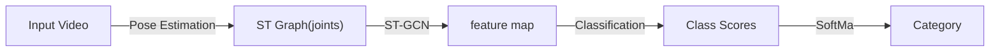

## 2018: Spatial Temporal Graph Convolutional Networks

### 1 Abstract

- 传统 <u>骨架建模方法</u>

    - 依赖 hand-crafted parts / traversal rules

    - 表达能力有限 & 泛化较为困难

- 创新点：提出 “空间-时间 图卷积网络 (ST-GCN)”

    - 基于动态骨架，包含：

        - 空间边：与关节之间的物理连接关系一致

        - 时间边：连接各个时间点中的同一关节

    - 自动学习时空 pattern（深度神经网络的优势），增强表达能力与泛化能力

### 2 Relatvie Works

- 动作识别 Human Action Recognition

    - 可以从多模态入手：外观、深度、光流 ...

    - 基于 “动态骨架建模” 的方法（Skeleton Based Action Recognition）相对较少

        “动态骨架“ 可以自然地表示为人体关节位置的时间序列，以二维或三维坐标的形式呈现。然后可以通过分析其运动模式来识别人体动作。

        - 早期方法简单将各时间点的关节坐标作为 feature，并对其进行时序分析

            => 没有利用关节之间的 <u>空间关系</u>

        - 大多数现有方法依赖于 <u>手工设计</u> 部件和规则，以实现对 *空间关系* 的分析

            手工设计的特征包括：关节轨迹协方差矩阵、关节相对位置、身体部位间的旋转评平移

            => 难以泛化

        - 近年来基于深度学习的方法使用 RNN/T-CNN 实现端到端的动作识别

- NN on Graph

    一般采用 CNN、RNN 和 GCN (图卷积网络)，其中 GCN 的主流解决方案如下：

    1. Spectral Perspective: 对于 GCN 中存在的 locality 采用 “谱分析” 的形式

    2. Spatial Perspective: 直接对图上某一特定节点 & 其 neighbors 应用卷积核（本文路径）

### 3 Approach

#### 1 Construct Skeleton Graph

对于给定的 $N$ 个关节 + $T$ 帧，构建 undirected spatial temporal graph $G = (V,E)$

- 节点集 $V = \{v_{ti}| t \in [1,T], i \in [1,N]\}$ 包含了所有帧上的所有关节点

    节点 $v_{ti}$ 的 Feature Vector $F(v_{ti})$由 坐标向量 + t 帧 i-th 节点的置信度构成

    > 节点坐标可以是 2D 或 3D 的

- 边集 $E$ 由两部分构成

    1. 同一帧的身体内部连接（Spatial）$E_S = \{\overline{v_{ti}v_{tj}}|(i,j) \in H\}$

    2. 帧间连接（Temporal）$E_F = \{ \overline{v_{ti}v_{(t+1)i}} \}$

- 作者通过以下两个步骤基于 *骨架序列* 构建 *空间-时间图* $G$

    1. 根据人体结构，连接同一帧内的各关节点（不是全连接，是火柴人）

    2. 连接每一帧中的统一关节点

#### 2 Spatial Graph Convolutional Neural Network

##### Spatial Graph Convolutional

- 对于编号为 $\tau$ 的帧，我们拥有：

    - 包含 N 个节点的节点集合 $V_{\tau}$
    - 帧内骨架边集合 $E_{S(\tau)} = \{\overline{v_{\tau i} v_{\tau j}}| (i,j) \in H\}$

- 考虑对 Image / Feature Map （2D数据）进行卷积：

    在 stride=1 + 适当 padding 时，可以实现 <u>输入输出 shape 一致</u>

    - 对于 kernel size = $K \times K$、输入 $F_{in}$ 具备 c 个通道的卷积操作，空间位置（节点） $x$ 处的单通道输出可以写为：

        $$
            f_{out}(x) = \sum_{h=1}^K \sum_{w=1}^K f_{in(p(x,h,w)) \cdot w(h,w)}
        $$

        - 其中 $p(·)= Z^2 \times Z^2 \rightarrow Z^2$ 为 采样函数，用于枚举节点 $x$ 的 neighbors

        - 权重函数 $w(·) = Z^2 \rightarrow \mathbb{R}^c$ 提供 c-dimension 下的权重向量

            => the filter weights are shared everywhere on the input image (与位置无关)

- 我们可以通过以下方式将卷积操作扩充到空间图 $V_t$ 上：

    - 对于图上的每一个节点，feature map $f_{in}^t: V_t \rightarrow \mathbb{R}^c$ 均有一个对应的特征向量

    此外，我们还需要重新定义采样函数 $p(·)$ 和权重函数 $w(·)$

    - Sampling function

        对于 Graph，我们将卷积操作定义在节点 $v_{ti}$ 及其 neighbors 集合 $B(v_{ti}) = \{v_{tj}|d(v_{ti},v_{tj}) \leq D\}$ 上

        > 其中 $d(v_{ti},v_{tj})$, $D = 1$ => 仅选择直接相邻的的节点

        我们可以将采样函数 $p(·): B(v_{ti}) \rightarrow V$ 改写为:

        $$
        p(v_{ti}, v_{tj}) = v_{tj}
        $$

    - Weight function

        由于 Graph 中的各个节点没有明确的相对位置（网格），本文根据一定策略将节点 $v_{ti}$ 的所有 neighbors $B(v_{ti})$ 划分为 $K$ 个子集，编号为 $[0, K-1]$

        => 经过划分，$v_{ti}$ 的每一个 neighbot 都会有一个数字标签（子集编号）

        此时的权重函数可以被实现为 shape = $c \times K$ 的矩阵，有：

        $$
        w(v_{ti}, v_{tj}) = w'(l_{ti}(v_{tj}))
        $$

- Spatial Graph Convolution

    在重新定义采样函数和权重函数后，我们可以将特定关节点 $v_{ti}$ 上的卷积操作记为：

    $$
    f_{out}(v_{ti}) = \sum_{v_{tj} \in B(v_{ti})} \frac{1}{Z_{ti}(v_{tj})} f_{in}(v_{tj}) \cdot w(l_{ti}(v_{tj}))
    $$

    其中正则化项 $Z_{ti}(v_{tj})$ 为邻接点 $v_{tj}$ 所在子集的 cardinality，用于平衡各子集对 output 产生的影响

##### Spatial Temporal Modeling

- 我们可以通过扩展 “邻域” 的概念，从而将 Spatial Conv 扩展到 Spatial-Temporal Conv

    将相邻帧上的同一 joint 节点也纳入 neighbor 的考量范围，给定关节点的邻域集合 $B$ 可记为：

    $$
    B(v_{ti}) = v_{qj}, \text{ where }
    \left\{
        \begin{align*}
            & d(v_{tj}, v_{ti}) \leq K \\
            & \|q-t\| \leq \lfloor \Gamma /2 \rfloor
        \end{align*}
    \right.
    $$

    - $\Gamma$ 用于控制时间上跨越的 n_frames，可以被视为 "temporal kernel size"

- 基于 single frame 下的 labeling func $l_{ti}(v_{tj})$，我们也以扩充到 S-T 范围：

    $$
        l_{ST}(v_{qj}) = l_{ti}(v_{tj}) + (q-t + \lfloor \Gamma / 2 \rfloor) \times K
    $$

#### 3 Partition Strategies

以 single frame 情况为例，讨论 3 种领域划分方式

1. Uni-labeling: 只有 1 个 == whole neighbor 的子集

    - $K = 1, l_{ti}(v_{tj}) = 0$

    - 每个相邻节点上的特征向量将与*相同的权重向量*进行内积

    - 在单帧情况下，使用这种策略相当于计算权重向量与所有相邻节点的*平均特征向*量之间的内积

        可能导致丢失局部差分特性

2. Distance partitioning: 根据两点间的路径距离 $d(v_{ti}, v_{tj})$ 划分
    > 本文考虑 $D==1$, 故 $d \in \{0,1\}$

    - $K = 2, l_{ti}(v_{tj}) = d(v_{ti}, v_{tj})$

    - $d=0$ 为中心位置 $v_{ti}$ 本身

    - $d=1$ 为其他与 $v_{ti}$ *直接相邻* 的节点

3. Spatial configuration partitioning: 根据以下策略将 neighbors 划分为三个子集

    1. $v_{ti}$ 本身

    2. centripetal group（向心）： 比 $v_{ti}$ 更靠近骨架 *重心* 的点集

    3. centrifugal group（离心）：剩下的点

    将 all frames 中指定关节 i 到重心的平均距离记为 $r_i$，有：

    $$
    l_{ti}(v_{tj}) = 
        \left\{
            \begin{align*}
                0 &\text{  if } r_j = r_i \\
                1 &\text{  if } r_j \lt r_i \\
                2 &\text{  if } r_j \gt r_i 
            \end{align*}
        \right.
    $$

#### 4 Learnable edge importance weighting

- 在人体运动时，骨架关节将以 Group 的形式移动；且同一个关节可能参与了多个 Group 的协作。

    为此，在模拟不同组别的过程中，同一关节可能具有不同的 “重要性”

- 作者因此在 ST-GCN 的每一层添加了一个 learnable mask $M$，将根据每个 Spatial Graph 中的边集 $E_S$ 学习权重

### 4 Implementation
> 由于对于 Graph 的卷积与 2D / 3D 卷积存在一些不同，此处介绍一些实现细节

- single frame 

    - 各关节节点的连接通过 *邻接矩阵* $A$ 表示

    - 此外有一个 identity matrix $I$ 用于表示 self-connections

    - 使用 uni-label partition strategy，则 ST-GCN 操作可记为：

        $$
        f_{out} = \Lambda^{-\frac{1}{2}}(A+I) \Lambda^{-\frac{1}{2}} f_{in}W
        $$

        - $\Lambda^{ii} \sum_j (A^{ij} + I^{ij})$

        - 所有通道的 weight vectors 相会堆叠形成权重矩阵 $W$

        - 将 $A+I$ 替换为 $(A+I) \otimes M$ 即可实现 “可学习的重要性掩码”，M 被初始化全 1 矩阵

- 神经网络架构

    - 由于 ST-GCN 的所有 nodes 共享权重矩阵，我们必须保证不同关节的 input 范围相同

        => 将原始的骨架数据放入 Batch Normalization Layer

    - ST-GCN 模型共包含了 9 个 units，有 9 种 temporal kernel size
        
        - 前三个 units 输出 64 channel，中间三个 units 输出 128 channels，最后三个 units 输出 256 channels

        - 每一个 unit 都应用了 ResNet 机制，并且以 $p=0.5$ 随机 drop feature 避免过拟合

        - 4th & 7th 时间卷积层的 `strides=2`，用作池化层

        - 最终输出将通过 Global Pooling 得到一个 256D 的 feature vector

    - feature vector 将通过 SoftMax Classifier 识别动作类型

## 2022: Skeleton-based Deep Pose Feature Learning

!!! warning "好像只是把 ST-GCN 叠了 10 层，再加一个 LSTM"

### 1 Abstract    

- 现有工作

    - Evaluate **single / sequential-defined** action in **short-term** videos

        > Sample: diving(跳水), vault(跳马)

    - Extract features **directly** from RGB videos through **3D-ConvNets**

        !!! bug "导致 feature 和 scene info 混淆在一起"
            - 但另一篇文章又批判了 skeleton-based 方法忽视了水花等环境因素，导致准确度下降
            - 大概得考虑一下 trade off？

- Long-duration Video 面临的挑战

    - Contain multiple chronologically(时序上) inconsistent actions

        e.g. 不同花滑短节目对于 滑行/跳跃/旋转 的编排顺序并不一致

    - Actions only have slight difference in a few frames

        e.g. 3Flip & 3Lutz 其实长得很像

- WHY Skeleton-based ？

    > Yes, but: 性能没有 RGB-Based 方法好

    - 不应该只提供一个 final score，还应该提供 meaningful feedbacks 帮助人们进行改进
  
    - Robust to changes in: appearance, lighting, surrounding env

- 本文工作：`deep pose feature learning` `long-duration videos (花滑/艺术体操)`

    - 特征提取：使用 **Spatial-Temporal Pose Extraction (STPE)** Module

        - Capture **subtle** changes
  
        - Obtain **skeletal data** in **space & time** dimensions
  
    - 时序特征表示：使用 **Inter-action Temporal Relation Extraction (ITRE)** Module

        通过 RNN 对骨架数据的时序特征进行建模

    - Score Regression：使用 FCN（全卷积网络）实现

    - Benchmarks: MIT-Skate, FIS-V

### 2 Relative Works

#### Skeleton-based AQA

在 Sports 领域的研究：

1. Pirsiavash 最早提出将 pose feature 应用于 AQA 领域

    通过 Discrete Cosine Transform (DCT) 对 pose feature 进行编码，随后使用 SVR 进行回归预测

2. Venkataraman 提出计算 multivariate approximate entropy (多变量近似熵)，对 单个关节的变化 & 关节间联系 进行建模

3. Nekoui 建立了 two-stream(双流) 网络，对 appearance & pose feature 分别进行建模

4. Pan 提出了 Graph-based Model 对 关节间协方差 & 身体局部动作 进行建模

---

与 GCN 相关的方法：（只在 diving 这样的短时任务中验证过）

> GCN 相比于其他卷积网络，在骨架数据这种 graph-structured 的特征上具有更好的泛化性

1. Bruce 提出了一个 two-task GCN 对 deep pose feature 进行提取

    应用于老年痴呆症的异常检测与质量评估

2. Nekoui 提出了数据集 ExPose，并使用了 ST-GCN 从提取的关节序列中提取 pose feature

### 3 Approach

??? info "Figure Skating Grading Rule"
    > 这里也标榜了一下 "based on the rules of Figure-Skating"，然后水了好长一段

    $$ \text{Final Score} = TES + PCS - TDS $$

    - 每个动作的 $TES = \text{basic score} + GOE$，$TDS \geq 0$ 是失误扣分
    - 一般有 9 位裁判，去掉 最高&最低 后取平均值

#### 1 骨架信息获取 & 预处理

记共有 $N$ 个视频的 Labled RGB 视频数据集 $V = \{v_i, l_i\}_{i= 1 \sim N}$

- 其中 i-th 具有 $m$ 帧的视频记为 $v_i = \{I_j\}_{j=1\sim m}$
- $l_i$ 是 i-th 视频的 ground-truth label

---

1. 对 i-th 视频进行 Pose Estimation 后，得到骨架数据 $v_i \rightarrow \{S_j\}_{j=1\sim m}$

    这篇文章使用了 OpenPose 提供的 18-joint Model

2. 对所有的 Skeleton Seq 采取相同的采样策略：只处理前 $T$ 帧，使 $s = \{S_j\}_{j=1\sim m} \rightarrow \{S_j\}_{j=1\sim T}$

3. 将 $s$ 划分为 $M$ 个不重叠的子序列 $s \rightarrow \{P_k\}_{k = 1 \sim M}$，每个子序列对应长度 $Z = \frac{T}{M}$

4. 考虑单个子序列 $P = \{p^i = \{(x_j^i, y_j^i, \text{ac}_j^i)\}_{j=1}^{18}\}_{i=1}^Z$

    其中： $(x_j, y_j)$ 是 j-th joint 在笛卡尔坐标系下的坐标，$\text{ac}_j$ 是该坐标的置信度

5. BatchNormalization： $x' = \frac{x - \mu}{\sigma}$

#### 2 时空姿态特征提取 (STPE)

熟悉的类 ST-GCN 思路：
> 好的，直接拿 ST-GCN 当 backbone 了

- Spatial Dimension: 使用 skeleton-graph 来表示关节及其连接关系
- Temporal Dimension:  把相邻 frame 里的同一个 joint 连起来就算完事

---

小小改进：

- Basic Block = SpatialConv layer $\rightarrow$ TemporalConv Layer $\rightarrow$ Dropout Layer
  
    SConv & TConv 的输出都有 BatchNorm + ReLU 的处理

- 堆叠 10 个 Basic Block：

    - 使用 $C$ 表示 feature Channel，$Z$ 为子序列时长，$J = 18$ 为关节总数
    - 令 temporal kernel size = 9 && $L_4, L_7$ strides = 2，则 `4-3-3` 层的输出通道数分别为 `64-128-256`

    $$
    \text{input}^{C \times Z \times J} \rightarrow \text{STPE} \rightarrow \text{output}^{256 \times Z' \times J} = f_p
    $$

#### 3 动作间时序联系提取 (ATRE)
> - 对于花滑来说 action 之间的衔接会影响 PCS 得分
> - 这里通过使用了 LSTM 的 RNN 实现

经过 STPE 模块的处理，我们得到了 pose feature $F_p = \{f_p^k\}_{k=1\sim m}$

1. 使用 全连接(FC) 层来

    - Remove redundant information
    - Reduce dimension of Pose Feature

2. 使用 BatchNorm 层提升泛化能力

---
> 关于 LSTM 的实现

使用一个 $M$ time steps 的 LSTM 网络（因为 segmentation 的数量是固定的）

- 共有 $M$ 个 Memory-cells 用于存储 info * output feature
  
- 每个 cell：
    - 输入 = i-th skeleton subSeq + 上一个 cell 的 output
    - layer 数量为 1，hidden size of layer = 256

- 最终输出 $f_t$（两种方案）：

    1. ✅ 最后一个 LSTM cell 的输出
    2. 所有 LSTM cells 输出的平均值

#### 4 回归预测

- 使用 3 Layers FCN(全连接神经网络) 进行特征降纬

    由于 STPE 的输出为 $C' \times Z' \times J$，3 Layers 的节点数分别为 `[C'*Z'*J, 2048, 1]`

- 使用 2 Layers FCN 进行回归预测，节点数分别为 `[256, 1]`

整个过程可被描述为：

$$
\hat{l} = \text{Activation}(\text{FC}(f_s)), f_s \in \{f_p, f_t\}
$$

!!! tip "Finding"
    由于两个 Benchmark 之间的分数分布不太一样，作者发现使用 `original data + ReLU()` 的效果 > `norm(data) + sigmoid()`

- Loss Function

    不同于其他方法复杂的损失函数，这里只用预测值与实际值之间的 MSE 误差

    $$
    L_{MSE} = \frac{1}{N}\sum_{i=1}^N(l_i - \hat{l}_i)^2
    $$