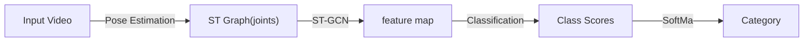

# 基于骨架的方法

## 2018: ST-GCN

> Spatial Temporal Graph Convolutional Networks

### 1 Abstract

- 传统 <u>骨架建模方法</u>

    - 依赖 hand-crafted parts / traversal rules

    - 表达能力有限 & 泛化较为困难

- 创新点：提出 “空间-时间 图卷积网络 (ST-GCN)”

    - 基于动态骨架，包含：

        - 空间边：与关节之间的物理连接关系一致

        - 时间边：连接各个时间点中的同一关节

    - 自动学习时空 pattern（深度神经网络的优势），增强表达能力与泛化能力

### 2 Relatvie Works

- 动作识别 Human Action Recognition

    - 可以从多模态入手：外观、深度、光流 ...

    - 基于 “动态骨架建模” 的方法（Skeleton Based Action Recognition）相对较少

        “动态骨架“ 可以自然地表示为人体关节位置的时间序列，以二维或三维坐标的形式呈现。然后可以通过分析其运动模式来识别人体动作。

        - 早期方法简单将各时间点的关节坐标作为 feature，并对其进行时序分析

            => 没有利用关节之间的 <u>空间关系</u>

        - 大多数现有方法依赖于 <u>手工设计</u> 部件和规则，以实现对 *空间关系* 的分析

            手工设计的特征包括：关节轨迹协方差矩阵、关节相对位置、身体部位间的旋转评平移

            => 难以泛化

        - 近年来基于深度学习的方法使用 RNN/T-CNN 实现端到端的动作识别

- NN on Graph

    一般采用 CNN、RNN 和 GCN (图卷积网络)，其中 GCN 的主流解决方案如下：

    1. Spectral Perspective: 对于 GCN 中存在的 locality 采用 “谱分析” 的形式

    2. Spatial Perspective: 直接对图上某一特定节点 & 其 neighbors 应用卷积核（本文路径）

### 3 Approach

#### 1 Construct Skeleton Graph

对于给定的 $N$ 个关节 + $T$ 帧，构建 undirected spatial temporal graph $G = (V,E)$

- 节点集 $V = \{v_{ti}| t \in [1,T], i \in [1,N]\}$ 包含了所有帧上的所有关节点

    节点 $v_{ti}$ 的 Feature Vector $F(v_{ti})$由 坐标向量 + t 帧 i-th 节点的置信度构成

    > 节点坐标可以是 2D 或 3D 的

- 边集 $E$ 由两部分构成

    1. 同一帧的身体内部连接（Spatial）$E_S = \{\overline{v_{ti}v_{tj}}|(i,j) \in H\}$

    2. 帧间连接（Temporal）$E_F = \{ \overline{v_{ti}v_{(t+1)i}} \}$

- 作者通过以下两个步骤基于 *骨架序列* 构建 *空间-时间图* $G$

    1. 根据人体结构，连接同一帧内的各关节点（不是全连接，是火柴人）

    2. 连接每一帧中的统一关节点

#### 2 Spatial Graph Convolutional Neural Network

##### Spatial Graph Convolutional

- 对于编号为 $\tau$ 的帧，我们拥有：

    - 包含 N 个节点的节点集合 $V_{\tau}$
    - 帧内骨架边集合 $E_{S(\tau)} = \{\overline{v_{\tau i} v_{\tau j}}| (i,j) \in H\}$

- 考虑对 Image / Feature Map （2D数据）进行卷积：

    在 stride=1 + 适当 padding 时，可以实现 <u>输入输出 shape 一致</u>

    - 对于 kernel size = $K \times K$、输入 $F_{in}$ 具备 c 个通道的卷积操作，空间位置（节点） $x$ 处的单通道输出可以写为：

        $$
            f_{out}(x) = \sum_{h=1}^K \sum_{w=1}^K f_{in(p(x,h,w)) \cdot w(h,w)}
        $$

        - 其中 $p(·)= Z^2 \times Z^2 \rightarrow Z^2$ 为 采样函数，用于枚举节点 $x$ 的 neighbors

        - 权重函数 $w(·) = Z^2 \rightarrow \mathbb{R}^c$ 提供 c-dimension 下的权重向量

            => the filter weights are shared everywhere on the input image (与位置无关)

- 我们可以通过以下方式将卷积操作扩充到空间图 $V_t$ 上：

    - 对于图上的每一个节点，feature map $f_{in}^t: V_t \rightarrow \mathbb{R}^c$ 均有一个对应的特征向量

    此外，我们还需要重新定义采样函数 $p(·)$ 和权重函数 $w(·)$

    - Sampling function

        对于 Graph，我们将卷积操作定义在节点 $v_{ti}$ 及其 neighbors 集合 $B(v_{ti}) = \{v_{tj}|d(v_{ti},v_{tj}) \leq D\}$ 上

        > 其中 $d(v_{ti},v_{tj})$, $D = 1$ => 仅选择直接相邻的的节点

        我们可以将采样函数 $p(·): B(v_{ti}) \rightarrow V$ 改写为:

        $$
        p(v_{ti}, v_{tj}) = v_{tj}
        $$

    - Weight function

        由于 Graph 中的各个节点没有明确的相对位置（网格），本文根据一定策略将节点 $v_{ti}$ 的所有 neighbors $B(v_{ti})$ 划分为 $K$ 个子集，编号为 $[0, K-1]$

        => 经过划分，$v_{ti}$ 的每一个 neighbot 都会有一个数字标签（子集编号）

        此时的权重函数可以被实现为 shape = $c \times K$ 的矩阵，有：

        $$
        w(v_{ti}, v_{tj}) = w'(l_{ti}(v_{tj}))
        $$

- Spatial Graph Convolution

    在重新定义采样函数和权重函数后，我们可以将特定关节点 $v_{ti}$ 上的卷积操作记为：

    $$
    f_{out}(v_{ti}) = \sum_{v_{tj} \in B(v_{ti})} \frac{1}{Z_{ti}(v_{tj})} f_{in}(v_{tj}) \cdot w(l_{ti}(v_{tj}))
    $$

    其中正则化项 $Z_{ti}(v_{tj})$ 为邻接点 $v_{tj}$ 所在子集的 cardinality，用于平衡各子集对 output 产生的影响

##### Spatial Temporal Modeling

- 我们可以通过扩展 “邻域” 的概念，从而将 Spatial Conv 扩展到 Spatial-Temporal Conv

    将相邻帧上的同一 joint 节点也纳入 neighbor 的考量范围，给定关节点的邻域集合 $B$ 可记为：

    $$
    B(v_{ti}) = v_{qj}, \text{ where }
    \left\{
        \begin{align*}
            & d(v_{tj}, v_{ti}) \leq K \\
            & \|q-t\| \leq \lfloor \Gamma /2 \rfloor
        \end{align*}
    \right.
    $$

    - $\Gamma$ 用于控制时间上跨越的 n_frames，可以被视为 "temporal kernel size"

- 基于 single frame 下的 labeling func $l_{ti}(v_{tj})$，我们也以扩充到 S-T 范围：

    $$
        l_{ST}(v_{qj}) = l_{ti}(v_{tj}) + (q-t + \lfloor \Gamma / 2 \rfloor) \times K
    $$

#### 3 Partition Strategies

以 single frame 情况为例，讨论 3 种领域划分方式

1. Uni-labeling: 只有 1 个 == whole neighbor 的子集

    - $K = 1, l_{ti}(v_{tj}) = 0$

    - 每个相邻节点上的特征向量将与*相同的权重向量*进行内积

    - 在单帧情况下，使用这种策略相当于计算权重向量与所有相邻节点的*平均特征向*量之间的内积

        可能导致丢失局部差分特性

2. Distance partitioning: 根据两点间的路径距离 $d(v_{ti}, v_{tj})$ 划分
    > 本文考虑 $D==1$, 故 $d \in \{0,1\}$

    - $K = 2, l_{ti}(v_{tj}) = d(v_{ti}, v_{tj})$

    - $d=0$ 为中心位置 $v_{ti}$ 本身

    - $d=1$ 为其他与 $v_{ti}$ *直接相邻* 的节点

3. Spatial configuration partitioning: 根据以下策略将 neighbors 划分为三个子集

    1. $v_{ti}$ 本身

    2. centripetal group（向心）： 比 $v_{ti}$ 更靠近骨架 *重心* 的点集

    3. centrifugal group（离心）：剩下的点

    将 all frames 中指定关节 i 到重心的平均距离记为 $r_i$，有：

    $$
    l_{ti}(v_{tj}) = 
        \left\{
            \begin{align*}
                0 &\text{  if } r_j = r_i \\
                1 &\text{  if } r_j \lt r_i \\
                2 &\text{  if } r_j \gt r_i 
            \end{align*}
        \right.
    $$

#### 4 Learnable edge importance weighting

- 在人体运动时，骨架关节将以 Group 的形式移动；且同一个关节可能参与了多个 Group 的协作。

    为此，在模拟不同组别的过程中，同一关节可能具有不同的 “重要性”

- 作者因此在 ST-GCN 的每一层添加了一个 learnable mask $M$，将根据每个 Spatial Graph 中的边集 $E_S$ 学习权重

### 4 Implementation
> 由于对于 Graph 的卷积与 2D / 3D 卷积存在一些不同，此处介绍一些实现细节

- single frame 

    - 各关节节点的连接通过 *邻接矩阵* $A$ 表示

    - 此外有一个 identity matrix $I$ 用于表示 self-connections

    - 使用 uni-label partition strategy，则 ST-GCN 操作可记为：

        $$
        f_{out} = \Lambda^{-\frac{1}{2}}(A+I) \Lambda^{-\frac{1}{2}} f_{in}W
        $$

        - $\Lambda^{ii} \sum_j (A^{ij} + I^{ij})$

        - 所有通道的 weight vectors 相会堆叠形成权重矩阵 $W$

        - 将 $A+I$ 替换为 $(A+I) \otimes M$ 即可实现 “可学习的重要性掩码”，M 被初始化全 1 矩阵

- 神经网络架构

    - 由于 ST-GCN 的所有 nodes 共享权重矩阵，我们必须保证不同关节的 input 范围相同

        => 将原始的骨架数据放入 Batch Normalization Layer

    - ST-GCN 模型共包含了 9 个 units，有 9 种 temporal kernel size
        
        - 前三个 units 输出 64 channel，中间三个 units 输出 128 channels，最后三个 units 输出 256 channels

        - 每一个 unit 都应用了 ResNet 机制，并且以 $p=0.5$ 随机 drop feature 避免过拟合

        - 4th & 7th 时间卷积层的 `strides=2`，用作池化层

        - 最终输出将通过 Global Pooling 得到一个 256D 的 feature vector

    - feature vector 将通过 SoftMax Classifier 识别动作类型

## 2019: Action Assessment by Joint Relation Graphs

### 1 Introduction

- 先前的工作

    - 大部分聚焦于 whole secene（包括 performer's body & background），但忽略了 detailed joint interactions

    - 由于各关节的动作质量一定程度依赖于其邻域，这使得细粒度的动作质量评估无法正确进行

    - 虽然部分工作尝试通过分析各 joint 的运动，但都是 individually 地进行分析

- 本文工作

    - 考虑了 locally connected joints 间的 interactive motion（而非 individually 的对每个关节点进行单独分析）
    - 构建了 trainable Joint Relation Graphs 并以此为基础对 joint motion 进行分析
    - 提出了两个新的 Modules:

        !!! info "Good Performance = Excellent Movement for each body part + Good Coordination among joints"

        - Joint Commonality Module：对 certain body part 的 general motion 进行建模

            locally connected joints 之间的运动共性反映了身体部分的 general motion

            通过在 spatial graph 中汇总关节运动来提取特定 time step 的身体部位动力学信息

        - Joint Difference Module：对于 body part 内的 motion difference 进行建模

            locally connected joints 之间的差异性反映了运动的协调性

            通过将每个关节与其在空间图和时间图中的局部连接邻居进行比较，来提取协调信息
  
    - 分析了本方法对于描述动作质量评估过程的可解释性

### 2 Related Works

#### Action Performance Assessment

- Gordon 首先探索了对视频进行自动动作评估的可行性，并尝试通过 skeleton trajectories 分析跳马

- 对外科手术评估的工作为不同的外科动作定义了 specific features，使得这些成果难以泛化

#### Relation Models
> CV 社区尝试对 semantic / spatial / temporal relation 进行建模

一些工作尝试对 skeleton structure 上的 spatial-temporal relations 进行建模

- 部分工作将 human skeleton 构建成 tree（移除了一些边）
- 部分工作对 neighbouring joints 进行提取，并重新进行排列（但 image 中相邻的点在真实骨骼结构中可能不相邻）
- Celiktutan 尝试对 skeleton dynamic sequences 进行分析，但忽视了单幅 skeleton graph 中各 joint 之间的联系

#### Graph-based Joint Relations

- 部分 Action Recognition 也尝试通过 graph 对 spatial-temporal joint relation 进行建模

    simply connect the same joints individually across time

    但由于 short-term, local fluency and proficiency 对于 AQA 十分重要，这一方法并不好用

- 本文通过分析 joints' neighbours on Both spatial & temporal relation graphs 来对更细粒度的特征进行建模

### 3 Approach

    

#### 1) Joint Commonality Module
> Learning motion of joint neighbourhoods

!!! info "learnable Spatial Relation Graph"
    > represents how much impact each neighbour has on the motion of a certain joint within each time step

    - 使用邻接矩阵 $A_s \in \mathbb{R}^{J\times J}$ 表示顶点间的连接关系（$J$ 为顶点总数），其元素值非负
        - relevant pair 上的元素 is learnable
        - irrelevant pair 上的元素被设为 0
    - $A_s(i,j)$ 表示 ith-node 对 jth-node 施加的影响

Joint Commonality Module 本质上是在 Spatial Relation Graph 进行 graphConv 操作，最终输出 Commonality Features

在进行 Conv 操作前，该模块学习了 individual joints' motion，而在卷积后对 neighbourhoods 进行了学习

- 假设进行 graphConv 前的 feature matrix 为 $H_c^t$，包含了 tth time-step 中所有节点的 hidden state

    $c \in \{0,1\}$ 表示 graphConv 是否已经执行

- graphConv 操作可以被视为 feature Matrix 与 adjacent Matrix 之间的乘积，即

    $$
    H_1^t = A_s · H_0^t \in \mathbb{R}^{J \times M}
    $$

    - $M$ 为 feature dimension of the hidden states
    - the hidden states contain the motion features of the joints BEFORE the convolution，即 $H_0^t = F^t \in \mathbb{R}^{J \times M}$

- 随后 Module 对所有 nodes 的 hidden state 进行聚合(MeanPooling)，得到 Commonality Feature

    $$
    \overline{h^t_c} = \frac{1}{N} ({H^t_c}^T · [1,1,1,...,1]^T)
    $$
#### 2) Joint Difference Module
> Great motion differences among joints within a neighbourhood indicate a lack of coordination

Joint Difference Module 本质上是将特定 joint 与其 spatial & temporal neighbours 进行对比，从而对 motion difference 进行学习，最终得到 Difference Features

!!! comment "目前只考虑特定 joint 在 *current & previous* time step 中的 neighbours"

!!! info "Temporal Relation Graph"
    > model the joint relations across two immediate time steps

    - 使用 $A_p \in \mathbb{R}^{J\times J}$ 表示节点间的邻接关系，被初始化为 $[0,1)$ 的随机数
    - $A_p(i,j)$ 表示 (t-1)th 中的 $v_i$ 对 tt 中的 $v_j$ 的影响

1. compute the motion differences between joint $i$ and each of its neighbours $j$

2. aggregates the motion differences with weighted sum (权重为 $w_j$)

    $$
    \begin{align*}
    D_s^t(i,m) &= \sum_j w_j · (A_s(i,j) · (F^t(i,m) - F^t(j,m)))\\
    D_p^t(i,m) &= \sum_j w_j · (A_p(i,j) · (F^t(i,m) - F^t(j,m)))\\
    &1 \leq i,j \leq J, 1 \leq m \leq M
    \end{align*}
    $$

3. 通过 MeanPooling 聚合得到 Difference Features $\overline{d^t_s}, \overline{d^t_p}$

    $$
    \overline{d^t_s} = \frac{1}{N}({D_s^t}^T · [1,1,1,...,1]^T)
    $$

#### 3) Regression Module

Input 包含了:

1. whole-scene video feature $q^t \in \mathbb{R}^M$（运动员在背景中的位置也是一个重要信息）
2. Commonality Features $\overline{h^t_c}$
3. Difference Features $\overline{d^t_s}, \overline{d^t_p}$

---

1. 通过 feature encoder 对 input feature 进行 encode

    $$
    \begin{align*}
    \hat{u^t_i} &= \text{EncodeFunc}_i(u_i^t)\\
    u_i^t &\in \{q^t,\overline{h^t_0}, \overline{h^t_1}, \overline{d^t_s}, \overline{d^t_p}\}
    \end{align*}
    $$

2. 使用 feature pooling layer 整合得到 overall feature $v^t$（$\alpha_i ,\beta_i$ 分别为 scalar & bias）

    $$
    v^t = \sum_i \alpha_i · \hat{u^t_i} + \beta_i
    $$

    为了降低不同 feature 之间存在的冗余，训练过程中会为 feature pooling layer 添加正则项：

    $$
    R_O = \sum_{i,j} \gamma · (\hat{u^t_i}^T · \hat{u^t_j})
    $$
    
3. 使用两个 FC Layer 进行回归计算（视频被划分为 $t$ 个 segments，并独立进行回归预测）

    $$
    \hat{s} = \sum_t \text{RegFunc}(v^t)
    $$

#### Evaluation

使用 MSE Loss，together with:

- orthogonal regularization term (with a weight 0.8)
- L2 regularization terms (with a weight 0.1) on the relation graphs

## 2022: Skeleton-based Deep Pose Feature Learning

!!! warning "好像只是把 ST-GCN 叠了 10 层，再加一个 LSTM"

### 1 Abstract    

- 现有工作

    - Evaluate **single / sequential-defined** action in **short-term** videos

        > Sample: diving(跳水), vault(跳马)

    - Extract features **directly** from RGB videos through **3D-ConvNets**

        !!! bug "导致 feature 和 scene info 混淆在一起"
            - 但另一篇文章又批判了 skeleton-based 方法忽视了水花等环境因素，导致准确度下降
            - 大概得考虑一下 trade off？

- Long-duration Video 面临的挑战

    - Contain multiple chronologically(时序上) inconsistent actions

        e.g. 不同花滑短节目对于 滑行/跳跃/旋转 的编排顺序并不一致

    - Actions only have slight difference in a few frames

        e.g. 3Flip & 3Lutz 其实长得很像

- WHY Skeleton-based ？

    > Yes, but: 性能没有 RGB-Based 方法好

    - 不应该只提供一个 final score，还应该提供 meaningful feedbacks 帮助人们进行改进
  
    - Robust to changes in: appearance, lighting, surrounding env

- 本文工作：`deep pose feature learning` `long-duration videos (花滑/艺术体操)`

    - 特征提取：使用 **Spatial-Temporal Pose Extraction (STPE)** Module

        - Capture **subtle** changes
  
        - Obtain **skeletal data** in **space & time** dimensions
  
    - 时序特征表示：使用 **Inter-action Temporal Relation Extraction (ITRE)** Module

        通过 RNN 对骨架数据的时序特征进行建模

    - Score Regression：使用 FCN（全卷积网络）实现

    - Benchmarks: MIT-Skate, FIS-V

### 2 Relative Works

#### Skeleton-based AQA

在 Sports 领域的研究：

1. Pirsiavash 最早提出将 pose feature 应用于 AQA 领域

    通过 Discrete Cosine Transform (DCT) 对 pose feature 进行编码，随后使用 SVR 进行回归预测

2. Venkataraman 提出计算 multivariate approximate entropy (多变量近似熵)，对 单个关节的变化 & 关节间联系 进行建模

3. Nekoui 建立了 two-stream(双流) 网络，对 appearance & pose feature 分别进行建模

4. Pan 提出了 Graph-based Model 对 关节间协方差 & 身体局部动作 进行建模

---

与 GCN 相关的方法：（只在 diving 这样的短时任务中验证过）

> GCN 相比于其他卷积网络，在骨架数据这种 graph-structured 的特征上具有更好的泛化性

1. Bruce 提出了一个 two-task GCN 对 deep pose feature 进行提取

    应用于老年痴呆症的异常检测与质量评估

2. Nekoui 提出了数据集 ExPose，并使用了 ST-GCN 从提取的关节序列中提取 pose feature

### 3 Approach

??? info "Figure Skating Grading Rule"
    > 这里也标榜了一下 "based on the rules of Figure-Skating"，然后水了好长一段

    $$ \text{Final Score} = TES + PCS - TDS $$

    - 每个动作的 $TES = \text{basic score} + GOE$，$TDS \geq 0$ 是失误扣分
    - 一般有 9 位裁判，去掉 最高&最低 后取平均值

#### 1 骨架信息获取 & 预处理

记共有 $N$ 个视频的 Labled RGB 视频数据集 $V = \{v_i, l_i\}_{i= 1 \sim N}$

- 其中 i-th 具有 $m$ 帧的视频记为 $v_i = \{I_j\}_{j=1\sim m}$
- $l_i$ 是 i-th 视频的 ground-truth label

---

1. 对 i-th 视频进行 Pose Estimation 后，得到骨架数据 $v_i \rightarrow \{S_j\}_{j=1\sim m}$

    这篇文章使用了 OpenPose 提供的 18-joint Model

2. 对所有的 Skeleton Seq 采取相同的采样策略：只处理前 $T$ 帧，使 $s = \{S_j\}_{j=1\sim m} \rightarrow \{S_j\}_{j=1\sim T}$

3. 将 $s$ 划分为 $M$ 个不重叠的子序列 $s \rightarrow \{P_k\}_{k = 1 \sim M}$，每个子序列对应长度 $Z = \frac{T}{M}$

4. 考虑单个子序列 $P = \{p^i = \{(x_j^i, y_j^i, \text{ac}_j^i)\}_{j=1}^{18}\}_{i=1}^Z$

    其中： $(x_j, y_j)$ 是 j-th joint 在笛卡尔坐标系下的坐标，$\text{ac}_j$ 是该坐标的置信度

5. BatchNormalization： $x' = \frac{x - \mu}{\sigma}$

#### 2 时空姿态特征提取 (STPE)

熟悉的类 ST-GCN 思路：
> 好的，直接拿 ST-GCN 当 backbone 了

- Spatial Dimension: 使用 skeleton-graph 来表示关节及其连接关系
- Temporal Dimension:  把相邻 frame 里的同一个 joint 连起来就算完事

---

小小改进：

- Basic Block = SpatialConv layer $\rightarrow$ TemporalConv Layer $\rightarrow$ Dropout Layer
  
    SConv & TConv 的输出都有 BatchNorm + ReLU 的处理

- 堆叠 10 个 Basic Block：

    - 使用 $C$ 表示 feature Channel，$Z$ 为子序列时长，$J = 18$ 为关节总数
    - 令 temporal kernel size = 9 && $L_4, L_7$ strides = 2，则 `4-3-3` 层的输出通道数分别为 `64-128-256`

    $$
    \text{input}^{C \times Z \times J} \rightarrow \text{STPE} \rightarrow \text{output}^{256 \times Z' \times J} = f_p
    $$

#### 3 动作间时序联系提取 (ATRE)
> - 对于花滑来说 action 之间的衔接会影响 PCS 得分
> - 这里通过使用了 LSTM 的 RNN 实现

经过 STPE 模块的处理，我们得到了 pose feature $F_p = \{f_p^k\}_{k=1\sim m}$

1. 使用 全连接(FC) 层来

    - Remove redundant information
    - Reduce dimension of Pose Feature

2. 使用 BatchNorm 层提升泛化能力

---
> 关于 LSTM 的实现

使用一个 $M$ time steps 的 LSTM 网络（因为 segmentation 的数量是固定的）

- 共有 $M$ 个 Memory-cells 用于存储 info * output feature
  
- 每个 cell：
    - 输入 = i-th skeleton subSeq + 上一个 cell 的 output
    - layer 数量为 1，hidden size of layer = 256

- 最终输出 $f_t$（两种方案）：

    1. ✅ 最后一个 LSTM cell 的输出
    2. 所有 LSTM cells 输出的平均值

#### 4 回归预测

- 使用 3 Layers FCN(全连接神经网络) 进行特征降纬

    由于 STPE 的输出为 $C' \times Z' \times J$，3 Layers 的节点数分别为 `[C'*Z'*J, 2048, 1]`

- 使用 2 Layers FCN 进行回归预测，节点数分别为 `[256, 1]`

整个过程可被描述为：

$$
\hat{l} = \text{Activation}(\text{FC}(f_s)), f_s \in \{f_p, f_t\}
$$

!!! tip "Finding"
    由于两个 Benchmark 之间的分数分布不太一样，作者发现使用 `original data + ReLU()` 的效果 > `norm(data) + sigmoid()`

- Loss Function

    不同于其他方法复杂的损失函数，这里只用预测值与实际值之间的 MSE 误差

    $$
    L_{MSE} = \frac{1}{N}\sum_{i=1}^N(l_i - \hat{l}_i)^2
    $$

## 2023: MS-GCN

> Multi-skeleton Structure Graph Convolution Network

### 1 Introduction

- 已有工作

    - 广泛的应用场景：physical therapy & rehabilitation, sporting event scoring, special skill training

    - 当前研究的一些不足：
        
        1. 大部分聚焦于 short video, 忽略了 long-duratoin videos。而长体育视频的 challenges 在于：

              - large action speed variance & duration
              - high similarity categories
  
        2. 通过 Deeplearning NN 从 RGB video 中提取信息的方法：
  
            - 忽视了 specific postures defnined by dynamic changes in human body joints 
            - 无法区分 3Lz-3Lp 与 3Lz-3Tp （但是 skeletion-based 方法可以）

    - Pose Estimation 技术对 AQA 的影响

        - 可以直接从 RGB video 中提取 Skeleton data
        - 现有方法只是根据无力结构对 joints 进行连接，忽略了语义信息以及身体各部分间的连接关系

- 本文工作

    - 提出了三种 skeleton structures 以实现对 关节 & 身体部位 运动模式的建模

        > Joints' self-connection, intra-part connection, inter-part connection

    - 设计了一个 Temporal Attention Learning Module，用于提取 skeleton subSeq 中的时序联系，并对不同 action 赋予正确的权重
  
    - benchmarks: MIT-Skate, Rhythmic Gymnastics

### 2 Related Works

#### RGB video-baesd AQA

- RGB video-based 方法通过提取丰富的时空信息，已经实现了对 *short-video* 中的 *simple action* 的有效评估
- 但受复杂场景因素影响（人体外观 / 背景变化），RGB-based 方法包含了许多无关的场景信息，使其不能准确描述人体运动

---

1. 少数人将 AQA 视为一个 level classifying task
2. 大多属人将 AQA 当做一个 regression task:

      - Dong 提出了 Multistage Regression Model (MSRM) 用于从不同的 hidden substages 中提取并 fuse feature
      - Li 提出了一个 2 * C3D + 2 * FC 的端到端模型，并使用了两个 loss（分别约束 quality score & rank）
      - Gao 将 agents 划分为 primary/secondary 两类，以对交互式动作中的非对称关系进行分析
      - Wang 提出了 TSA 模型，使用 single object tracker 来区分前后景

3. 最近，也有一些人聚焦于 pair-ranking task:

     - Doughty 最初考虑了将任意两个视频组成输入，并提出了 similarity loss
     - Jain 使用 C3D 进行特征提取，并通过 Siamese Network 实现了 reference-guided evaluation
     - Yu 使用 I3D 提取特征，并通过 GART 来学习一对视频间的 relative score

#### Skeleton-based AQA

!!! warning "现有的 Skeleton-based Methods 聚焦于 local 信息"
    他们通过构建 single joint adjacnet matrix 来表示人体骨骼的自然拓扑结构

    但这种方法忽略了无骨骼连接关节间的隐含信息，以及 global 视角下身体各部分间关系中暗含的信息

    => 这使得提取信息对于人体运动特征的表征肤浅、不充分，进而降低预测性能

- Prisiavash 首先将 pose estimation 应用于 AQA（DCT + SVR）
- Bruce 提出了基于 GCN 的方法，将 feature embed into 2D-Vecs，并通过 SoftMax Classifier 探测异常动作
- Pan 提出在短视频中应用 joints relation graph，他们提出了两个模块：一个模块从身体部位动力学中提取特征，另一个模块从关节协调中学习。

    在随后的工作中，他们开发了一种自适应动作评估系统，该系统可以根据关节相互作用为不同类型的动作自动构建不同的评估架构

- [Action Recognition] Plizzari 提出了 two-stream Spatial-Temporal Transformer Network (ST-TR)，使用 Spatial/Temporal Self-attention Module 分别对帧内/帧间关系进行建模

- 一些方法尝试将 appearance & pose 信息结合，他们通常采用双流网络独立处理两种特征，并在 fuse 后进行回归预测

### 3 Approach

    

#### 1) Skeleton Sequence Extraction & Sampling

- 本文使用 18-joints OpenPose + avanced 2D Pose Estimation 进行特征提取

- 考虑到长视频中 skeletonSeq 存在信息冗余，本文首先在 temporal demension 上进行采样：

    对于 skeletonSeq $S = \{s_i^t\}_{i=1\sim 18}^{t=1\sim T} = \{(x_i^t, y_i^t ,acc_i^t)\}$

    1. 使用 uniform sampling strategy with fixed interval $\Delta l$，有：$S' = \{s'_l\}_{l=1\sim L}, L = T/\Delta l$
    2. 使用 uniform partition strategy 将采样后的 skeletonSeq 划分成 $G$ 个不重叠的 subSeqs (每个 subSeq 的长度为 $L/G$)

#### 2) Deep Pose Feature Learning

??? info "3 types of skeleton structures"
    

        
    

    1. Joints' Self-connection $A_{self}$

        以 local 视角聚焦于关节本身，确保每个 joint 在卷积过程中能被平等对待

    2. Intra-part Connection $A_{intra}$

        根据骨骼自然连接关系定义，对身体特定部位的运动模式进行建模

    3. Inter-part Connection $A_{inter}$

        使得从属于不同身体部位的 joint 间产生依赖关系，确保能捕捉到 global 信息

对于 normalized skeleton subSeq $P = \{(x,y,acc)_v^t\}_{v=1\sim 18}^{t=1\sim T} \in \mathbb{R}^{3\times V \times T'}$，使用以下的方式对于 skeleton graph 进行 encode：

- 构建 Spatial Relation Graph $A = A_{self},A_{intra},A_{inter}$

    - $A_{self}$ 是一个 $V \times V$ 的 identity matrix，$A_{intra},A_{inter}$ 是 $V\times V$ 的邻接矩阵

    - $A_{ij} \in \{0,1\}$ 表示顶点 $(v_i, v_j)$ 间是否存在边

- 构建 MS-GCN: a hierachy of 10 stacked blocks
    - 10个 blocks 的输出通道数为 64\*4 + 128\*3 + 256\*3
    - 4th & 7th 的 `strideSize=2`，其他层均为 1
    - 输入 $P_{in} \in \mathbb{R}^{C_{in} \times 18 \times T'}$
    - 最后一层的输出将被 flattern 为一个 vector，并输入一个具有 $d$ 个神经元的 FC Layer 进行降纬，得到 $f_p \in \mathbb{R}^d$

- 单个 block 的结构如下：
    

    1. GCN Layer 拥有三个独立的 Conv Operator 以分别处理三个 Graph $A$，从而抽取 motion pattern of joints & body parts。

        - 整个 block 在 Spatial 纬度上的操作可以表述为：$P_{spatial}(v_i) = \sum_{j=1}^{18} \sum_{k=1}^3 (M_{ij}^k \odot A_{ij}^k)P_{in}(v_j) W^k$
        
        - $M^k$ 用于 scale the contribution of a nodes' feature，$W^k$ 是 Conv Kernel
    
    2. TCN Layer 通过 2D Conv (`kernelSize = 9*1`) 实现

        - GCN & TCN 层后都跟了一个 BatchNorm；此外，为了训练的稳定性增加了 residual connection

        - 整个 block 的处理过程可以描述为：$P_{out} = \sigma(\gamma_{temporal}(\sigma(\gamma_{spatial}(P_{in}))))$，$\sigma = ReLU(BatchNorm(·))$
            
#### 3) Temporal Attention Learning
> extract features from the layout & arrangement of actions

经过 MS-GCN 模块处理，我们可以得到 Pose Features $F_p = \{f_p^m\}_{m=1\sim G} \in \mathbb{R}^d$（$m$ 为 skeleten subSeq 编号）

1. 此处使用拥有 $G$ 个 cells 的 LSTM 来提取 subSeqs 间的 temporal structures，对于每个 cell 来说

    - `n_layer = 1`, `n_hidden_size = d'`
    - input = mth-pose features + 上一个 cell 的输出
    - output = temporal relation feature $f_t^m \in \mathbb{R}^{d'}$，所有 cell 的输出集合记为 $F_t = \{f_t^m\}_{m=1\sim G}$

2. 根据 self-attention learning strategy 将新的 $F_t$ embed 成 vector

3. 根据 embedded vector 生成 correlation matrix & attention weight

4. 使用 $SoftMax(·)$ 对 attention weight 进行 normalize

5. 将 weighted sum 作为新的 feature

---

上述过程可以描述为：

$$
\begin{align*}
e_m &= V_p^T tanh(W_pf_t^m) \\
\hat{F}_t &= \sum_{m=1}^G \alpha(e_m) f_t^m
\end{align*}
$$

- $V_p \in \mathbb{R}^{d'}, W_p \in \mathbb{R}^{d' \times d'}$ 均为可训练参数，用于计算 correlation

- $e_m$ 代表 self-attention learning 对 mth-cell output 估计的 attention weight

- $\alpha(·)$ 表示对 weight vec $\{e_m\}_{,=1\sim G}$ 进行的 SoftMax 操作

- $\hat{F}_t \in \mathbb{R}^{d'}$ 是 Temporal Attention Learning 得到的最终特征

#### 4) Score Prediction & Evaluation

- 分数预测通过 一个全连接层 + 激活函数 实现：
  
    $$
    \hat{S} = \text{activation}(FC(\hat{F}_t))
    $$

- 使用 MSE Loss 以最小化预测总分与 ground-truth 之间的误差 ($N$ 为 batchSize)：

    $$
    \mathcal{L} = \frac{1}{n} \sum_{n=1}^N (\hat{S}_n - L_n)^2
    $$