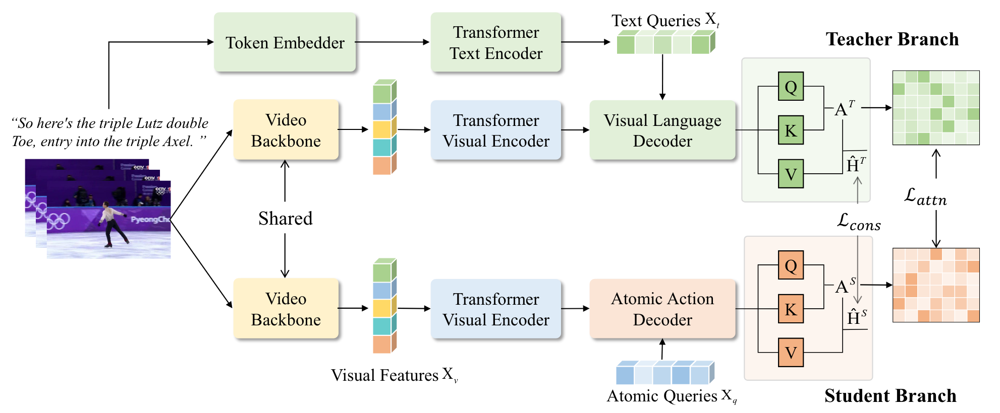

## 2021: SGN
> Semantics-Guided Representations (for Figure Skating)

### 1 Introduction

- 先前的工作

    - 大多数工作局限于根据 visual input 预测得分，限制了 depict highlevel semantic representation 的能力

        他们侧重于利用 *视觉上下文信息*，但未探索视频中的语义信息

    - 如何通过计算机视觉对 semantic reprsentation 进行 depicts and interacts 仍未明确

- 本文工作

    - 聚焦于提取 Figure-Skating 项目中的 semantic-aware representations
    - 提出了 Semantic-Guided Network (SGN) 以弥合 语义-视觉信息 之间的差距
        - 是一个 teacher-student-based network (with attention mechanism)
        - 使得知识从 semantic domain 迁移到 visual domain
    - 在 teacher branch 通过 cross-attention 机制聚合 semantic descriptions & visual features，为 visual domain 提供监督

        除 OlympicFS 提供的 comments 外，teacher branch 中的语义表示也可以从音乐等模态中提取

    - 在 student branch 使用了一串 learnable atomic queries 来模拟 teacher branch 的 semantic-aware distribution

        旋转、跳跃等细粒度 query 使得模型能够识别视频中的关键原子动作，其训练受 semantic domain 中的 teacher 监督
    
    - 提出了三种 Loss 来 align 来自不同 domain 的 features
    - 提出了*多模态*数据集 OlympicFS，提供了 score + professional comments。数据来自 2018年平昌冬奥会 和 2022年北京冬奥会。
    - benchmarks: OlympicFS, FS1000, Fis-v, MTL-AQA(diving)

### 2 Related Works

#### Figure Skating Analysis

- CV 领域关于 FS 的最早研究是 Pirsiavash 在 14 年基于 ST-Pose feature 训练的回归模型

- Xu 从女子单人项目中收集了 500 个视频，并提出了一种包含 self-attentive & multi-scale LSTM 的机制，用于学习 local & global SeqInfo

- 数据集 FSD-10 包含了 男子/女子 项目中的 10 种不同动作，并提出了用于 *分类* 的 key-frame-based temporal segment network

- ACTION-Net 学习了在特定帧中检测到的运动员的视频动态信息和静态姿势，以加强视频中的特定姿势。

- EAGLE-Eye 构建了一个双流网络，用于推理表演过程中关节协调和外观动态之间的关系。

- Xia 提出多模态模型 MLP-Mixer（音频 + 视觉信息），并通过 memory recurrent unit 有效地学习长期表示；同时收集了 FS1000 数据集。
#### Multimodal Learning

最近，Transformer 模型不仅在 NLP 中得到了广泛应用，同时在 CV 任务重表现出了良好的性能。

虽然这些方法依赖于大规模数据集，并采用多模态自监督任务进行预训练。

!!! warning "但 AQA 领域尚未提出多模态大规模模型"

### 3 Approach

#### 1) Feature Extraction

- 对于视频输入：

    1. 使用 *Temporal segment networks* 将输入视频划分为 $T_v$ 个 segments
    2. 使用 *Video swin transformer* 从 segment 中提取 visual feature
    3. 使用 MLP 进行特征降维，得到 $X_v \in \mathbb{R}^{T_v \times D}$

- 对于文字输入：使用 token embedder + BERT 提取特征 $X_t \in \mathbb{R}^{T_t \times D}$

#### 2) Extract Semantic-Aware Representations

!!! bug "每个 clip 仅包含当前 segment 的信息，缺少 global context info"

1. 使用 self-attention Encoder 来充实 segment-wise representation

    - 通过计算 weighted aggregation of segment features 来得到 context info

        此处的 weight 由当前 segment 与其他 segments 之间的协方差决定

    $$
    H_0 = \text{SoftMax}\left(
        \frac{W_{qs} X_v (W_{ks} X_v)^T}{\sqrt{D}}
    \right) W_{vs} X_v + X_v
    $$

    - $W_{qs}, W_{ks}, W_{vs}$ 都是可训练参数

2. 使用 feed-forward network (FFN) 对 $H_0$ 进行进一步 fusion，得到 $\hat{X}_v$

##### Teacher Branch
> 从评论文本中提取 semantic-aware representations

- 通过构建 visual-text feature 之间的 cross-attention 来学习 semantic corr.

- (受 DETR 启发) 本文的 Transformer Decoder 共包含三部分: self-attention, croess-atention, FFN

    - self-attention 用于挖掘 text feature 之间的关系，得到 $\hat{X}_t$
    - cross-attention 用于从 $\hat{X}_t, \hat{X}_v$ 中学习 context-aware representations

        - $query$ 通过 $\hat{X}_t$ 生成，$key, value$ 从 $\hat{X}_v$ 变换得到

        $$
        Q_t=W_q\hat{X}_t,\ K_v = W_k\hat{X}_v,\ V_v = W_v\hat{X}_v
        $$

        - semantic corr $A^T$ 由对应 $query-key$ 之间的 dot-product similarity 衡量

        $$
        A^T = \text{SoftMax}\left(\frac{Q_tK_v^T}{\sqrt{D}}\right)
        $$

    - FFN 用于 aggregate $A^T, V_v$，得到最终输出 $H^T$

        $$
        H^T = FFN(A^T V_v) \in \mathbb{R}^{T_t \times D}
        $$

#### 3) Semantics-Guided Network

- 先前的多模态模型会把 visual-semantic info 混合在一起进行预测
- 本文则是通过 semanticRep 指导对 visual feature 的学习

##### Student Branch

- 定义长度为 $K$ 的 atomic queries $X_q \in \mathbb{R}^{K \times D}$

    这些 query 用于表示评分中的关键语义信息，例如出色的跳跃或糟糕的摔倒。

    在应用 self-attention 后更新为 $\hat{X}_q$

- 类似于 teacher branch，student branch 也由三部分构成（不过用 queries 替代了 $\hat{X}_t$）

    $$
    \begin{align*}
    Q'_q &= W'_q \hat{X}_q,\ K'_v = W'_k\hat{X}_v,\ V'_v = W'_v \hat{X}_v \\
    A^S &= \text{SoftMax}\left(\frac{Q'_q K'^T_v}{\sqrt{D}}\right) \in \mathbb{R}^{K \times T_v}\\
    H^S &= FFN(A^S V'_v) \in \mathbb{R}^{K \times D}
    \end{align*}
    $$

    $A^S$ 是 attention map，$H^S$ 是 student branch 的输出

#### Evaluation

- distillation loss

    - 目标：最小化 $A^T, A^S$ 两个 self-attention matrices 之间的差异
    - 但是 $A^T \in T_t \times T_v,\ A^S \in K \times T_v$ 具有不同的 shape ($T_t \gg K$)，因此需要沿 $T_t/K$ 纬度进行 MaxPooling，生成 $\hat{A}^T / \hat{A}^S$

        这样可以提取最显著的特征并增强特征表示能力，而不会丢失有用的信息

    $$
    \mathcal{L}_{attn} = \frac{1}{T_v h} \sum_{i=1}^{T_v} \sum_{j=1}^h \text{MSE}(\hat{A}_{ij}^T, \hat{A}_{ij}^S)
    $$

    $h$ 为 Transformer 中的 attention heads，$\hat{A}_{ij}$ 是 ith-clip jth-head 的 normalized attention

- objective loss

    除了限制 teacher-student branch 的 attention distribution 之外，作者还使用了 Noise Contrastive Estimation(NCE) loss 来 align teacher-student branch 之间的 output feature

    - 通过将 target instance $H^S$ 与更多的 negative sample 进行对比，并与对应的 positive sample$H^T$ 进行 align

    - 在 $T_t/K$ 纬度上使用 AveragePooling 来将 teacher-student feature 映射到相同的纬度上

    $$
    \mathcal{L}_{cons} = -\log{\frac{\exp{(\text{sim}(\hat{H^S_i},\hat{H^T_i})/\tau)}}
    {\sum_{j=1}^N\mathbb{1}_{[j \neq i]}\exp{(\text{sim}(\hat{H^S_i},\hat{H^T_i})/\tau)}}}
    $$

    - $\mathbb{1}_{[j \neq i]}$ 是一个 indicatorFunc，当 $j\neq i$ 时取 1
    - $\text{sim}(u,v) = u^T v / |u||v|$ 表示 $l_2$ normalized 的 $u·v$ 点积
    - $\tau$ 是 temperature 超参数
    - 这一 loss 在 mini-batch $N$ 中的所有 positive-pairs 间被计算

- scoring loss

    - 本文将 AQA 任务定义为：预测和具有相同 category 视频间的 $\Delta s$
    - 对于输入对 $<X_{v.p}, X_{v,q}>$，其 ground-truth 为 $<S_p, S_q>$，有：

        $$
        L_{score} = (\Delta S - |S_p - S_q|)^2 = (\mathcal{R}_{\Theta}(\hat{H_p},\hat{H_q}) - |S_p - S_q|)^2
        $$
    
    - 由于模型具有 teacher-student 两个 branch，因此会有两个 relative score，分别记为 $\mathcal{L}_{score}^T,\mathcal{L}_{score}^S$

- consistency loss

    - to align the learned feature representations: 限制 teacher branch 预测的 $\Delta S^T$ 与 student brach 预测的 $\Delta S^S$ 相等

    $$
    \mathcal{L}_{c-score} = (\Delta S^T - \Delta S^S)^2
    $$

将以上各项相加，可得 total loss $\mathcal{L}$

$$
\mathcal{L} = \mathcal{L}_{score}^T + \mathcal{L}_{score}^S + \mathcal{L}_{attn} + \mathcal{L}_{cons} + \mathcal{L}_{c-score}
$$

## 2023: FSPN

### 1 Abstract

- 先前的工作

    - 大多数基于 粗粒度(coarse-grained)特征 进行训练、采用 holistic video representations，缺乏对 fine-grained intra-class variations 的捕捉

    - Parmar and Morris 认为所有的 sub-action sequences 对结果具有 <u>相等的贡献</u>

    - segmenting action sequences along with their temporal dependence remains a challenging task：

        1. 缺少预定义的 标签 & action sequence 之间的关联性

        2. sub-action sequences 具有非常细的粒度，动作间的变化十分平滑 => 难以确定其边界

        3. 由于动作十分细密、在相似的背景中进行，各 sub-action 之间有较多的共同 attributes

- 创新点

    提取 fine-grained sub-action sequence 和它们的 temporal dependencies 有助于做出更准确的估计

    > 为了降低背景的干扰，本文使用预训练模型从 input video 中提取了 actor-centric regions 

    1. 提出了由两部分组成的 FSPN：
    
        - <u>intra-sequence</u> action parsing module **无监督**
        
            对更细粒度下的 sub-actions 进行挖掘
            
            实现 semantical sub-action parsing，从而更准确的描述动作序列间的细微差别
        
        - spatiotemporal multiscale transformer module

            > 低阶特征缺乏语义信息，高阶特征难以对 sub-action 进行细粒度描述

            学习 <u>motion-oriented</u> action features、挖掘其在不同时间范围内的 long-range 依赖关系

    2. 提出了一个 group contrastive loss

    此外，由于整个动作序列可能存在组件重复 ABBBBCC，模型使用了 1D Temporal Convolution + Transformer Network 来提取 single-scale feature

    最终，各阶段特征会通过 multiscale temporal fusion 聚合生成 unified feature represen- tation，并用于最终的预测

### 2 Relative Works

1. AQA

    - Regression Formulation

    - Pairwise Ranking Formulation

2. (Fine-grained) Action Parsing 

    - Zhang: Temporal Query Networks => 通过 query 找出相关的 segments

    - Dian: TransParser =>  对 sub-action 进行挖掘（无监督）

3. Vision Transformer

    从 低分辨率图片 & 较小的通道数量 开始，逐渐增加通道并减少 spatial resolution

### 3 Approach

#### 问题定义

对于给定 input video $x_i \in \mathbb{R}^{T \times H \times W \times C}$ 及其对应的分数标签 $y_i$，AQA 问题可以认为是一个回归问题：

> T, H, W, C 分别为 clip 长度、视频宽高、通道数

1. 使用预训练模型 $D(.)$ 得到运动员所在的 BBox $x_a$

    $$
        x_a = D(x_i) \in \mathbb{R}^{T \times H \times W \times C}
    $$

2. 将 原始输入 和 BBox 都输入 (相同的)I3D 来提取 spatiotemporal 特征 $(f_i, f_a)$

    $$
    f_i = E_v(x_i),\ f_a = E_v(x_a)
    $$

3. 使用 FSPN $\mathbb{F}_\Theta(.)$ 提取特征，并最终进行回归运算

    $$
    \overline{y}_i = R_{\theta}(\mathbb{F}_\Theta(E_v(x_i)),\mathbb{F}_\Theta(E_v(x_a)))
    $$

#### Intra-Sequence Action Parsing

##### 1 Intra-Sequence Action Parsing (IAP)

!!! tip "确定每个 sub-action 的 起始帧 & 结束帧"

- 给出的 Parser 可以对 $S$ 个 sub-action 的分布概率进行预测，同时指出 “转变” 发生的具体帧编号 $f^{th}$：

    features -> probability vec $A_s$ (对 $s^{th}$ sub-action 的 middle-level 表示)

    $$
    [A_1, ..., A_s] = IAP(f_i,f_a)
    $$

- 使用 up-sampling decoder + MLP layers projection head 构建 “分布概率预测器”

    - 上采样包含四个 spatial-temporal dimensions 分别为：(1024, 12), (512, 24), (256, 48), and (128, 96) 的子块
    
        - temporal axis 会被卷积操作扩充

        - spatial dimensions 会被 Max Pooling 削减

    - 使用了 3 Layer MLP

- $A_s(\vec{t})$ 表示 $t^{th}$ 帧可能对应的 sub-action 概率分布；$\vec{t}_s$ 是对 $s^{th}$ 跳 action sequence 的预测结果

    > $\text{argmax } A_s(\vec{t})$ 即为该帧最可能对应的 sub-action 类型
    >
    > 此时 t 与 t+1 必然对应不同的 sub-aciton => 新的 sub-action instance 从 $(t+1)^{th}$ 帧开始

    $$
    \vec{t}_s = \text{argmax } A_s(\vec{t}),\ \frac{T}{S}(s-1) \leq \vec{t} \leq \frac{T}{S}s
    $$

    上式保证了 $\vec{t}_1 \leq ... \leq \vec{t}_s$

##### 2 Group Contrastive Learning

- 上一步得到的 $(f_i,f_a)$ 共享了较多的语义信息，直接对其进行比较学习会导致 <u>对具有相同语义的动作序列学习得到不同的表示</u>

    => 使用 Group Contrastive Learning，对具有相似 sub-action seq 的视频进行对比

- 输入的 $(f_i,f_a)$ 会被

    - 赋予与其动作、语义具有最大相似度组别的 Pseudo Label $p$
    - 最终生成 sub-action sequence $(\overline{f}_i,\overline{f}_a)$

- 具有相同 Pseudo Label 的 feature 将组成如下的 group：

    $$
    G^p_k = \frac{\sum_{i=1}^B g(A_s^k)}{T_B},\ \text{where } p=A_s^k
    $$

    - $g(.)$ 是序列 $A_s^k$ 的 logits

    - $T_B$ 是 Group $B$ 的序列总量

- 我们使用 Group 的 average representation $G_f^g$，定义：

    - positive-pair：$G_a^p, G_i^p$ （上标组别相同）

    - negative-pair：$G_a^p, G_k^q$ （上标组别不同）

        > Action Seq 相同，但 Sub-action Seq 不同

#### Spatio-Temporal Multiscale Transformer

!!! tip "输入 sub-action sequence $(\overline{f}_i,\overline{f}_a)$，并在不同 scale 上挖掘 long-range dependencies"

##### 1 Actor-Centric Multiscale Transformer

- 本文提出的 Transformer 各阶段具有各异的 channel resolution => channel & scale 逐渐增加

- 该 Multiscale Transformer，由 3 * stage（结构相同）构成
    
    - 每个 stage 

        - 在 early Layer 处理粗粒度特征，并在更深层处理细粒度特征
    
        - 各包含了 3 个 transformer block + 8 attention head，用于处理相同 scale 的信息并生成 Attention 值

            $$
            \hat{f}_i += MLP(LN(attention)), attention = Multihead(LN(\frac{Q_a(K_i)^T}{\sqrt{d_k}})V_i) + \overline{f}_i
            $$

            
$Ln(.)$ 为 Layer Norm 操作，$MLP$ 为两层使用 GELU 激活函数

            

            
            
block 结构：$\overline{f}_a = query, \overline{f}_i=memory$

    - 对于输入特征 $f \in \mathbb{R}^{T' \times C'}$:

        1. 进行一次 1D 卷积 (kernel=3, stride=1)

        2. 使用包含 $L$ 个 block 的 Multiscale Transformer，其中 stage n 的 output_shape = $T' \times 2^nC'$（放大）

            > channel dimesion 会在 stage 切换时通过 MLP 扩大 2 倍

##### 2 Multiscale Temporal Fusion

对于第 $n$ 层的 output shape 为 $F_n = T' \times 2^nC'$，而第 $n+1$ 层则为 $F_{n+1}= T' \times 2^{n+1}C'$

- 为了成功进行 aggregate，我们需要进行 upsampling: $U_\varphi(F_n) = \text{Upsampling}(R_n\mathcal{W}^n)$

- 随后使用 element-wise addition 更新 $F_{n+1} = U_\varphi(F_n) + F_{n+1}\mathcal{W}^{n+1}$

最终通过 fuse 的到的 intergrated feature $\mathcal{F} = \text{Concat}(F_1, ..., F_{N})$

### 4 Optimization

#### Overall Training Loss

最终将由 2-Layer MLP 对 $\text{MaxPool}(\mathcal{F})$ 预测得到分组标签 $\gamma_i$ 和 回归分数 $y_i$

- 对于回归预测，有：

    $$
    \begin{align*}
    L_{bce} &= - \sum_{i=1}^I(\gamma_i log(\overline{\gamma_i}) + (1-\gamma_i)log(1-\overline{\gamma}_i)) \\
    L_{reg} &= \sum_{i=1}^I \| \overline{y}_i - y_i\|^2,\ \text{where } \gamma_i = 1
    \end{align*}
    $$

- 对 Group Contrastive，有：

    $$
    L_{gc} = - \log{\frac{
        h(G_a^p,G_i^p) / \tau
    }{
        h(G_a^p,G_i^p) / \tau + \sum_{q=1,k}^S  h(G_a^p,G_k^q) 
    }}, \text{ where }p\neq q
    $$

    - $h(.) = \exp{(\text{cosine similarity})}$ 

    - $\tau$ 是 teperature 超参数
