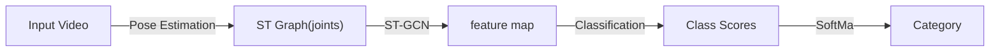

# 汇总

## 1 Video-based AQA (综述)

### 1-1 Definition & Challenges

- 相关领域：Human Action Recognition & Analysis

    - 现有的技术支持 action classification of short/long-term videos, temporal action segmentation and spatial-temporal action
location
    
    - 在 video sruveillance, vedio retrieval & human-computer interaction 领域有着广泛应用

    !!! bug "只能对动作进行 粗粒度的分类/定位，并不能对特定动作的质量进行客观评价"
    
    - 强调识别、捕捉不同种类动作之间的 external differences

    > AQA 则聚焦于同一种类动作间的 internal differences

- AQA 问题目标

    得到一个能 *自动做出客观评价的智能系统*，从而减少在动作评估中投入的人力物力、并降低主观影响。

#### Definition & Form

- Video-based AQA 是一个基于视频数据生成对特定动作质量客观评价的 internal differences 任务

- 用于 AQA 和 HAR 任务的 **模型** 具有一定程度的相似性：

    首先进行 feature extraction，随后通过 network head 实现复杂任务

    - 传统方法会采取 <u>DFT/DCT/linear combination</u> 实现 feature aggregation

    - 深度学习方法的发展则使得通过 <u>深层卷积网络(DCN)/RNN</u> 进行 video embedding 成为可能

- AQA 任务大致可被划分为以下三种：

    1. Regression Scoring：常见于运动领域
    
        - 一般直接使用 <u>SVR/FCN</u> 直接进行预测
        
        - 以 MSE 作为优化目标

    2. Grading：常见于对手术操作的评分

        - 实际上是个分类任务，输出的是诸如 `novice`, `medium`, `expert` 的标签

        - 一般使用 classification accuracy 进行评估

    3. Pairwise Sorting

        - 从测试集里面随手抓两个（一对）视频进行拉踩

        - 使用 pairwise sorting accuracy 进行评估

#### Challenges

- Area Specifed

    - Medical Care：由于医疗动作具有较高的时间复杂度、语言信息量和低容忍度，医疗相关的 AQA 解决方案需要有较强的语义理解能力

    - Sports：body distortion & motion blur

- Common Challenges

    计算效率、视角遮挡、模型可解释性  etc.

### 1-2 Datasets & Evaluation

Datasets for AQA

<table>
<tr>
    <th>类型</th>
    <th>名称</th>
    <th>Desc.</th>
</tr>
<tr>
    <td rowspan="8">Sport</td>
    <td>MIT-Diving</td>
    <td>60fps, 平均每个视频包含 150 帧，分数范围为 [20,100]</td>
</tr>
<tr>
    <td>MIT-Skiing</td>
    <td>24fps, 平均每个视频包含 4200 帧，分数范围为 [0,100]</td>
</tr>
<tr>
    <td>UNLV Dive & UNLV Vault</td>
    <td>平均每个视频包含 75 帧，分数范围为 [0,20]</td>
</tr>
<tr>
    <td>Basketball Performance Assessment Dataset</td>
    <td>24 Train + 24 Test，有 250 + 250 个 pair label</td>
</tr>
<tr>
    <td>AQA-7</td>
    <td>包含7种运动的视频，803 train + 303 test</td>
</tr>
<tr>
    <td>MTL-AQA</td>
    <td>16种不同类别的跳水视频，每个由7位裁判打分</td>
</tr>
<tr>
    <td>FisV-5</td>
    <td>平均时长为 2min50s，由9位裁判评判 TES & PCS</td>
</tr>
<tr>
    <td>Fall Recognition in Figure Skating</td>
    <td>276 顺利落冰 + 141 摔倒</td>
</tr>
<tr>
    <td>Medical Care</td>
    <td>包含缝合、穿针、打结三部分，有部分分和总评分</td>
</tr>
<tr>
    <td rowspan="3">Others</td>
    <td>Epic skills 2018</td>
    <td>包含揉面团、绘画、使用筷子三个子集</td>
</tr>
<tr>
    <td>BEST</td>
    <td>平均时长为 188s，包含5种不同日常活动的视频</td>
</tr>
<tr>
    <td>Infinite grasp dataset</td>
    <td>包含了94个婴儿抓东西的视频，时长在 80-500s，有 pair label</td>
</tr>
</table>

Performance Metrics

<table>
<tr>
    <th>Task</th>
    <th>Metric</th>
</tr>
<tr>
    <td>Regression Scoring</td>
    <td>均方误差 MSE</td>
</tr>
<tr>
    <td>Grading</td>
    <td>Classification Accuracy</td>
</tr>
<tr>
    <td>Pairwise Sorting</td>
    <td>Spearman Correlation Coefficient</td>
</tr>
</table>

!!! info "Spearman Correlation Coefficient $\rho$"

    $$
    \rho = \frac{\sum_i(p_i - \overline{p})(q_i - \overline{q})}{\sqrt{\sum_i(p_i - \overline{p})^2 \sum_i(q_i - \overline{q})^2}}
    $$

### 1-3 Models (截至 2021)

- Medical Skill Evaluation

    由于对医疗动作评估问题的研究早于深度学习方法的发展，大多数医疗相关的模型都使用了 <u>traditional feature</u>

- Sport AQA

    由于起步相对较晚，体育相关的研究使用 CNN 和 RNN 实现了较好的成果

    1. based on Deep Learning

        - 通常使用 2D-CNN/3D-CNN/LSTM 来进行 feature extract & aggregate
        
        - 通过 Network Head 来适配不同类型的任务

        根据关注点不同可划分为: Structure Design / Loss Desgin 两类

    2. based on Handcrafted Features (before 2014)

- Medical Care

    由于较强的专业性，医疗领域没有一个可以作为统一 benchmark 的数据集

    - GIT 聚焦于 OSATS 系统下的外壳手术技能评估

    - JHU 聚焦于 机器人微创手术(RMIS)

    - ASU 聚焦于 腹腔镜手术(laparoscopic surgery)

### 1-4 发展前景

- Dataset

    目前存在的 AQA 数据集规模较小，且包含的语义信息较少

    => 希望在未来推出更大规模、包含更多语义信息的数据集

- Model: more Efficient & Accurate
    
    - 更好的利用 temporal info 对动作进行建模

    - 使用 Unsupervised 方法减少数据标注、降低主观影响

    - 对 复杂、长期 动作的质量进行评估

## 2 PECoP

### 2-1 Abstract

- 先前的工作

    - 因为有标签的 AQA 数据很少，先前的工作一般基于在 large-scale domain-general dataset 上预训练的模型进行优化

        => 在存在较大 domain shift 时，模型的 generalisation 较差

    - 侧重点不同：

        - 在 Parkinson’s Disease 严重性评估中，运动节奏中的一两次间断都会对 quality score 产生极大影响

        - 而在 pretraining task（动作分类）中，轻微（甚至更加严重的）区别并不会影响 action classification

    - Continual Pretraining

        主要用于 NLP，以通过 domain-specific unlabeled data 训练任务专精的模型

        这种方法要求更新所有参数，同时存储针对所有 separate task 的 params

    - BatchNorm Tuning

        支持通过仅调节 BatchNorm Layer 参数获取 domain-specific model

        但是在 较小的 / 更加 domain-specific 的 AQA 数据集中不起作用

- 创新点

    PECoP 通过增加一个额外的预训练过程来 reduce domain shift（专注于特定 AQA 任务）：

    - 往预训练的 3D CNN 外面包一层 3D-Adapters <u>自监督学习</u> spatiotemporal & in-domain info

    - 只更新 Adapter 中的参数，预训练模型参数保持不变

        > 此处拉踩需要更新 <u>所有参数</u> 的 HPT

### 2-2 Relative Works

- AQA：如 Tang(USDL)，Yu（CoRe）

    大多数方法将 AQA 视为 监督学习（score）的 回归任务，并尝试降低裁判的主观影响
    
    !!! bug "这些方法都忽视了 base dataset(K400) 和 target dataset 之间的 domain gap"

- SSL for AQA

    近期的一些方法开始尝试 自监督学习（SSL）。在传统的 Regression Loss 外，在迁移学习中增加了 SSL Loss（不需要添加额外的数据标注）

    如 Liu 应用了 Self-Supervised Contrasive Loss

- Continual Pretraining

    相比于传统的迁移学习，Continual Pretraining 通过 in-domain SSL 增强了 domain shift 问题

    - Gururangan：证明了增加 in-domain data pretraining 对于文本分类性能的影响

    - Reed：证明了在更接近 target dataset 的数据集上进行 Continual Pretraining 可以加快收敛、提高鲁棒性

    - Azizi：结合了 supervised pretraining（on ImageNet） & intermediate contrastive SSL（on MedicalImages），得到了具有更佳泛化性的医学图像诊断器

- Adapters

    Transformer 架构的 lightweight bottleneck module，用于实现 parameter-efficient 迁移学习

    - Chen：
    
        - 提出 AdaptFormer 用于可量化的 img/video 识别任务

        - 提出 Conv-Adapter，使其可以应用于 2D CNN

### 2-3 Approach

- Training Set：

    1. $D_g$: large-scale, labelled, domain-general
    2. $D_t$: target video dataset in the AQA domain

    两个数据集分别对应具有 significant domain discrepancy 的学习任务 $T_g, T_t$

- Test Set: $D_q \subseteq D_t$, unlabelled

- Target：在 $D_g， D_t$ 上调参，以找到一个可用于 $D_q$ 的 transferable spatiotemporal feature extractor 

#### Domain-general pretraining

这一部分直接使用了 pretrained backbone model —— 在 K400 上经过监督学习得到的 I3D 模型

#### In-domain SSL continual pretraining

- 本文提出的 3D-Adapter 和 Transformer & 2D CNN 中的相应模块具有类似的结构，在此基础上添加了 3D Layers 以实现视频数据的 3D CNN 操作

- 在每一个 Inception Module 的 concatenation Layer 后插入一个 3D-Adapter 可以得到显著的性能提升

    > 事实上 R3D + 3D-Adapter 也能提升性能

添加 3D-Adapter 后的 Inception Module

- 3D-Adapter modules 将被 **随机初始化** 

- 每一个 3D-Apater 使用了：

    - 可学习参数 $\theta_{down}$ —— downsampling · depth-wise · 3D convolution
    - 非线性激活函数 $f(.)$，如 ReLU
    - 可学习参数 $\theta_{up}$ —— upsampling · point-wise · 3D convolustion

- 相关参数如下：

    - $C_{in}, C_{out}$： 输入/输出 的 channel dimensions
    - compression factor $\lambda$： bottleneck dimension

因此，对于给定的 input feture vecor $h_{in} \in \mathbb{R}^{C_{in} \times D \times H \times W}$，3D-Adapter 将输出 $h_{out} \in \mathbb{R}^{C_{out} \times D \times H \times W}$

具体变换过程可描述为：

$$
h_{out} = \alpha \odot (\theta_{up} \otimes f(\theta_{down} \overline{\otimes} h_{in})) + h_{in}
$$

其中：

- $\otimes, \overline{\otimes}$ 分别表示 depth-wise / point-wise 卷积操作
- $\alpha \in \mathbb{R}^{C_{out}}$ 是可调超参数，初始化为 ones
- $\odot$ 表示 element-wise 乘法

---

Continual Pretraining 阶段：

!!! tip "只有 3D-Adapter 中的参数会被更新"

- 在集合 $D_q$ 中以 SSL 形式进行 —— 视频标签由模型自动生成

- 使用了 Video Segment Pace Prediction (VSPP) 进行了预处理，从而对 “以不同速度完成的动作” 进行对比，生成视 SSL 标签信息：

    - speed rate $\lambda_i$
    
    - Segment No. $\zeta_i$

!!! info "一些拉踩信息"
    1. 关于 SSL Pretext 的选取
    
        作者也尝试使用了 Constrastive-Based 的 RSPNet & 同样是 Transformatoin-Based 的 VideoPace，但表现都不及 VSPP

    2. 关于 BatchNorm Tuning（对比 Adapter）

        在小型数据库上容易过拟合

#### Supervised fine-tuning

!!! question "为啥还要 Fine-Tuning (?)"
    本文 3D-Adapter 只对 I3D 模块进行 Continual Pretraining，整个模型的参数还是需要微调

!!! tip "在这个阶段，<u>所有参数（预训练参数 & 3D-Adapter）</u> 将在 $D_t$ 上被微调"

- USDL / MUSDL

    - 特征 -> I3D backbone -> temporal Pooling -> SoftMax -> 预测分布

    - 使用 *预测分布* 与 *由 ground-truth 产生的高斯分布* 之间的 KL loss 进行优化

    > MUSDL 是 USDL 的 multi-path 版本，适用于 MTL-AQA / JIGSAWS 这种由多个裁判同时打分的数据集

- CoRe

    - 使用添加 3D-Adapter 的 I3D 模型进行特征提取，随后丢回 GART 进行回归

    - 最终结果取多个 exampler 的平均

- TSA

    使用添加 3D-Adapter 的 I3D 模型进行特征提取，随后丢回 Attention Module 进行后续操作

## 3 ST-GCN

### 3-1 Abstract

- 传统 <u>骨架建模方法</u>

    - 依赖 hand-crafted parts / traversal rules

    - 表达能力有限 & 泛化较为困难

- 创新点：提出 “空间-时间 图卷积网络 (ST-GCN)”

    - 基于动态骨架，包含：

        - 空间边：与关节之间的物理连接关系一致

        - 时间边：连接各个时间点中的同一关节

    - 自动学习时空 pattern（深度神经网络的优势），增强表达能力与泛化能力

### 3-2 Relatvie Works

- 动作识别 Human Action Recognition

    - 可以从多模态入手：外观、深度、光流 ...

    - 基于 “动态骨架建模” 的方法（Skeleton Based Action Recognition）相对较少

        “动态骨架“ 可以自然地表示为人体关节位置的时间序列，以二维或三维坐标的形式呈现。然后可以通过分析其运动模式来识别人体动作。

        - 早期方法简单将各时间点的关节坐标作为 feature，并对其进行时序分析

            => 没有利用关节之间的 <u>空间关系</u>

        - 大多数现有方法依赖于 <u>手工设计</u> 部件和规则，以实现对 *空间关系* 的分析

            手工设计的特征包括：关节轨迹协方差矩阵、关节相对位置、身体部位间的旋转评平移

            => 难以泛化

        - 近年来基于深度学习的方法使用 RNN/T-CNN 实现端到端的动作识别

- NN on Graph

    一般采用 CNN、RNN 和 GCN (图卷积网络)，其中 GCN 的主流解决方案如下：

    1. Spectral Perspective: 对于 GCN 中存在的 locality 采用 “谱分析” 的形式

    2. Spatial Perspective: 直接对图上某一特定节点 & 其 neighbors 应用卷积核（本文路径）

### 3-3 Approach

#### 1 Construct Skeleton Graph

对于给定的 $N$ 个关节 + $T$ 帧，构建 undirected spatial temporal graph $G = (V,E)$

- 节点集 $V = \{v_{ti}| t \in [1,T], i \in [1,N]\}$ 包含了所有帧上的所有关节点

    节点 $v_{ti}$ 的 Feature Vector $F(v_{ti})$由 坐标向量 + t 帧 i-th 节点的置信度构成

    > 节点坐标可以是 2D 或 3D 的

- 边集 $E$ 由两部分构成

    1. 同一帧的身体内部连接（Spatial）$E_S = \{\overline{v_{ti}v_{tj}}|(i,j) \in H\}$

    2. 帧间连接（Temporal）$E_F = \{ \overline{v_{ti}v_{(t+1)i}} \}$

- 作者通过以下两个步骤基于 *骨架序列* 构建 *空间-时间图* $G$

    1. 根据人体结构，连接同一帧内的各关节点（不是全连接，是火柴人）

    2. 连接每一帧中的统一关节点

#### 2 Spatial Graph Convolutional Neural Network

##### Spatial Graph Convolutional

- 对于编号为 $\tau$ 的帧，我们拥有：

    - 包含 N 个节点的节点集合 $V_{\tau}$
    - 帧内骨架边集合 $E_{S(\tau)} = \{\overline{v_{\tau i} v_{\tau j}}| (i,j) \in H\}$

- 考虑对 Image / Feature Map （2D数据）进行卷积：

    在 stride=1 + 适当 padding 时，可以实现 <u>输入输出 shape 一致</u>

    - 对于 kernel size = $K \times K$、输入 $F_{in}$ 具备 c 个通道的卷积操作，空间位置（节点） $x$ 处的单通道输出可以写为：

        $$
            f_{out}(x) = \sum_{h=1}^K \sum_{w=1}^K f_{in(p(x,h,w)) \cdot w(h,w)}
        $$

        - 其中 $p(·)= Z^2 \times Z^2 \rightarrow Z^2$ 为 采样函数，用于枚举节点 $x$ 的 neighbors

        - 权重函数 $w(·) = Z^2 \rightarrow \mathbb{R}^c$ 提供 c-dimension 下的权重向量

            => the filter weights are shared everywhere on the input image (与位置无关)

- 我们可以通过以下方式将卷积操作扩充到空间图 $V_t$ 上：

    - 对于图上的每一个节点，feature map $f_{in}^t: V_t \rightarrow \mathbb{R}^c$ 均有一个对应的特征向量

    此外，我们还需要重新定义采样函数 $p(·)$ 和权重函数 $w(·)$

    - Sampling function

        对于 Graph，我们将卷积操作定义在节点 $v_{ti}$ 及其 neighbors 集合 $B(v_{ti}) = \{v_{tj}|d(v_{ti},v_{tj}) \leq D\}$ 上

        > 其中 $d(v_{ti},v_{tj})$, $D = 1$ => 仅选择直接相邻的的节点

        我们可以将采样函数 $p(·): B(v_{ti}) \rightarrow V$ 改写为:

        $$
        p(v_{ti}, v_{tj}) = v_{tj}
        $$

    - Weight function

        由于 Graph 中的各个节点没有明确的相对位置（网格），本文根据一定策略将节点 $v_{ti}$ 的所有 neighbors $B(v_{ti})$ 划分为 $K$ 个子集，编号为 $[0, K-1]$

        => 经过划分，$v_{ti}$ 的每一个 neighbot 都会有一个数字标签（子集编号）

        此时的权重函数可以被实现为 shape = $c \times K$ 的矩阵，有：

        $$
        w(v_{ti}, v_{tj}) = w'(l_{ti}(v_{tj}))
        $$

- Spatial Graph Convolution

    在重新定义采样函数和权重函数后，我们可以将特定关节点 $v_{ti}$ 上的卷积操作记为：

    $$
    f_{out}(v_{ti}) = \sum_{v_{tj} \in B(v_{ti})} \frac{1}{Z_{ti}(v_{tj})} f_{in}(v_{tj}) \cdot w(l_{ti}(v_{tj}))
    $$

    其中正则化项 $Z_{ti}(v_{tj})$ 为邻接点 $v_{tj}$ 所在子集的 cardinality，用于平衡各子集对 output 产生的影响

##### Spatial Temporal Modeling

- 我们可以通过扩展 “邻域” 的概念，从而将 Spatial Conv 扩展到 Spatial-Temporal Conv

    将相邻帧上的同一 joint 节点也纳入 neighbor 的考量范围，给定关节点的邻域集合 $B$ 可记为：

    $$
    B(v_{ti}) = v_{qj}, \text{ where }
    \left\{
        \begin{align*}
            & d(v_{tj}, v_{ti}) \leq K \\
            & \|q-t\| \leq \lfloor \Gamma /2 \rfloor
        \end{align*}
    \right.
    $$

    - $\Gamma$ 用于控制时间上跨越的 n_frames，可以被视为 "temporal kernel size"

- 基于 single frame 下的 labeling func $l_{ti}(v_{tj})$，我们也以扩充到 S-T 范围：

    $$
        l_{ST}(v_{qj}) = l_{ti}(v_{tj}) + (q-t + \lfloor \Gamma / 2 \rfloor) \times K
    $$

#### 3 Partition Strategies

以 single frame 情况为例，讨论 3 种领域划分方式

1. Uni-labeling: 只有 1 个 == whole neighbor 的子集

    - $K = 1, l_{ti}(v_{tj}) = 0$

    - 每个相邻节点上的特征向量将与*相同的权重向量*进行内积

    - 在单帧情况下，使用这种策略相当于计算权重向量与所有相邻节点的*平均特征向*量之间的内积

        可能导致丢失局部差分特性

2. Distance partitioning: 根据两点间的路径距离 $d(v_{ti}, v_{tj})$ 划分
    > 本文考虑 $D==1$, 故 $d \in \{0,1\}$

    - $K = 2, l_{ti}(v_{tj}) = d(v_{ti}, v_{tj})$

    - $d=0$ 为中心位置 $v_{ti}$ 本身

    - $d=1$ 为其他与 $v_{ti}$ *直接相邻* 的节点

3. Spatial configuration partitioning: 根据以下策略将 neighbors 划分为三个子集

    1. $v_{ti}$ 本身

    2. centripetal group（向心）： 比 $v_{ti}$ 更靠近骨架 *重心* 的点集

    3. centrifugal group（离心）：剩下的点

    将 all frames 中指定关节 i 到重心的平均距离记为 $r_i$，有：

    $$
    l_{ti}(v_{tj}) = 
        \left\{
            \begin{align*}
                0 &\text{  if } r_j = r_i \\
                1 &\text{  if } r_j \lt r_i \\
                2 &\text{  if } r_j \gt r_i 
            \end{align*}
        \right.
    $$

#### 4 Learnable edge importance weighting

- 在人体运动时，骨架关节将以 Group 的形式移动；且同一个关节可能参与了多个 Group 的协作。

    为此，在模拟不同组别的过程中，同一关节可能具有不同的 “重要性”

- 作者因此在 ST-GCN 的每一层添加了一个 learnable mask $M$，将根据每个 Spatial Graph 中的边集 $E_S$ 学习权重

### 3-4 Implementation
> 由于对于 Graph 的卷积与 2D / 3D 卷积存在一些不同，此处介绍一些实现细节

- single frame 

    - 各关节节点的连接通过 *邻接矩阵* $A$ 表示

    - 此外有一个 identity matrix $I$ 用于表示 self-connections

    - 使用 uni-label partition strategy，则 ST-GCN 操作可记为：

        $$
        f_{out} = \Lambda^{-\frac{1}{2}}(A+I) \Lambda^{-\frac{1}{2}} f_{in}W
        $$

        - $\Lambda^{ii} \sum_j (A^{ij} + I^{ij})$

        - 所有通道的 weight vectors 相会堆叠形成权重矩阵 $W$

        - 将 $A+I$ 替换为 $(A+I) \otimes M$ 即可实现 “可学习的重要性掩码”，M 被初始化全 1 矩阵

- 神经网络架构

    - 由于 ST-GCN 的所有 nodes 共享权重矩阵，我们必须保证不同关节的 input 范围相同

        => 将原始的骨架数据放入 Batch Normalization Layer

    - ST-GCN 模型共包含了 9 个 units，有 9 种 temporal kernel size
        
        - 前三个 units 输出 64 channel，中间三个 units 输出 128 channels，最后三个 units 输出 256 channels

        - 每一个 unit 都应用了 ResNet 机制，并且以 $p=0.5$ 随机 drop feature 避免过拟合

        - 4th & 7th 时间卷积层的 `strides=2`，用作池化层

        - 最终输出将通过 Global Pooling 得到一个 256D 的 feature vector

    - feature vector 将通过 SoftMax Classifier 识别动作类型