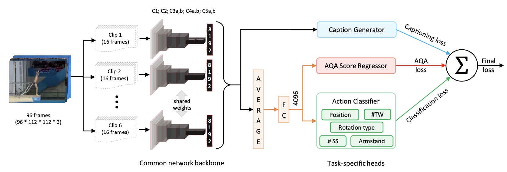
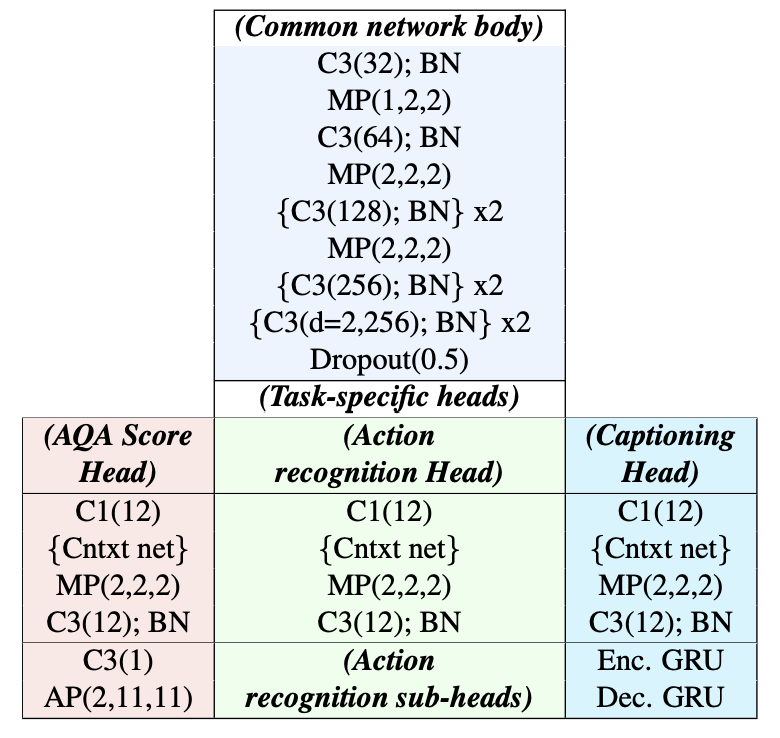

# 几篇综述

## 2021: A Survey of Video-based AQA

### 1 Definition & Challenges

- 相关领域：Human Action Recognition & Analysis

    - 现有的技术支持 action classification of short/long-term videos, temporal action segmentation and spatial-temporal action
location
    
    - 在 video sruveillance, vedio retrieval & human-computer interaction 领域有着广泛应用

    !!! bug "只能对动作进行 粗粒度的分类/定位，并不能对特定动作的质量进行客观评价"
    
    - 强调识别、捕捉不同种类动作之间的 external differences

    > AQA 则聚焦于同一种类动作间的 internal differences

- AQA 问题目标

    得到一个能 *自动做出客观评价的智能系统*，从而减少在动作评估中投入的人力物力、并降低主观影响。

#### Definition & Form

- Video-based AQA 是一个基于视频数据生成对特定动作质量客观评价的 internal differences 任务

- 用于 AQA 和 HAR 任务的 **模型** 具有一定程度的相似性：

    首先进行 feature extraction，随后通过 network head 实现复杂任务

    - 传统方法会采取 <u>DFT/DCT/linear combination</u> 实现 feature aggregation

    - 深度学习方法的发展则使得通过 <u>深层卷积网络(DCN)/RNN</u> 进行 video embedding 成为可能

- AQA 任务大致可被划分为以下三种：

    1. Regression Scoring：常见于运动领域
    
        - 一般直接使用 <u>SVR/FCN</u> 直接进行预测
        
        - 以 MSE 作为优化目标

    2. Grading：常见于对手术操作的评分

        - 实际上是个分类任务，输出的是诸如 `novice`, `medium`, `expert` 的标签

        - 一般使用 classification accuracy 进行评估

    3. Pairwise Sorting

        - 从测试集里面随手抓两个（一对）视频进行拉踩

        - 使用 pairwise sorting accuracy 进行评估

#### Challenges

- Area Specifed

    - Medical Care：由于医疗动作具有较高的时间复杂度、语言信息量和低容忍度，医疗相关的 AQA 解决方案需要有较强的语义理解能力

    - Sports：body distortion & motion blur

- Common Challenges

    计算效率、视角遮挡、模型可解释性  etc.

### 2 Datasets & Evaluation

!!! warning "TES 和 PCS相关性不大 (by MS-LSTM)"

<center>Datasets for AQA</center>

<table>
<tr>
    <th>类型</th>
    <th>名称</th>
    <th>Desc.</th>
</tr>
<tr>
    <td rowspan="8">Sport</td>
    <td>MIT-Diving</td>
    <td>60fps, 平均每个视频包含 150 帧，分数范围为 [20,100]</td>
</tr>
<tr>
    <td>MIT-Skiing</td>
    <td>24fps, 平均每个视频包含 4200 帧，分数范围为 [0,100]</td>
</tr>
<tr>
    <td>UNLV Dive & UNLV Vault</td>
    <td>平均每个视频包含 75 帧，分数范围为 [0,20]</td>
</tr>
<tr>
    <td>Basketball Performance Assessment Dataset</td>
    <td>24 Train + 24 Test，有 250 + 250 个 pair label</td>
</tr>
<tr>
    <td>AQA-7</td>
    <td>包含7种运动的视频，803 train + 303 test</td>
</tr>
<tr>
    <td>MTL-AQA</td>
    <td>16种不同类别的跳水视频，每个由7位裁判打分</td>
</tr>
<tr>
    <td>FisV-5</td>
    <td>平均时长为 2min50s，由9位裁判评判 TES & PCS</td>
</tr>
<tr>
    <td>Fall Recognition in Figure Skating</td>
    <td>276 顺利落冰 + 141 摔倒</td>
</tr>
<tr>
    <td>Medical Care</td>
    <td>包含缝合、穿针、打结三部分，有部分分和总评分</td>
</tr>
<tr>
    <td rowspan="3">Others</td>
    <td>Epic skills 2018</td>
    <td>包含揉面团、绘画、使用筷子三个子集</td>
</tr>
<tr>
    <td>BEST</td>
    <td>平均时长为 188s，包含5种不同日常活动的视频</td>
</tr>
<tr>
    <td>Infinite grasp dataset</td>
    <td>包含了94个婴儿抓东西的视频，时长在 80-500s，有 pair label</td>
</tr>
</table>

<center>Performance Metrics</center>

<center>
<table>
<tr>
    <th>Task</th>
    <th>Metric</th>
</tr>
<tr>
    <td>Regression Scoring</td>
    <td>均方误差 MSE</td>
</tr>
<tr>
    <td>Grading</td>
    <td>Classification Accuracy</td>
</tr>
<tr>
    <td>Pairwise Sorting</td>
    <td>Spearman Correlation Coefficient</td>
</tr>
</table>
</center>

!!! info "Spearman Correlation Coefficient $\rho$"

    $$
    \rho = \frac{\sum_i(p_i - \overline{p})(q_i - \overline{q})}{\sqrt{\sum_i(p_i - \overline{p})^2 \sum_i(q_i - \overline{q})^2}}
    $$

### 3 Models (截至 2021)

- Medical Skill Evaluation

    由于对医疗动作评估问题的研究早于深度学习方法的发展，大多数医疗相关的模型都使用了 <u>traditional feature</u>


- Sport AQA

    由于起步相对较晚，体育相关的研究使用 CNN 和 RNN 实现了较好的成果

    1. based on Deep Learning

        - 通常使用 2D-CNN/3D-CNN/LSTM 来进行 feature extract & aggregate
        
        - 通过 Network Head 来适配不同类型的任务

        根据关注点不同可划分为: Structure Design / Loss Desgin 两类

    2. based on Handcrafted Features (before 2014)

- Medical Care

    由于较强的专业性，医疗领域没有一个可以作为统一 benchmark 的数据集

    - GIT 聚焦于 OSATS 系统下的外壳手术技能评估

    - JHU 聚焦于 机器人微创手术(RMIS)

    - ASU 聚焦于 腹腔镜手术(laparoscopic surgery)

### 4 发展前景

- Dataset

    目前存在的 AQA 数据集规模较小，且包含的语义信息较少

    => 希望在未来推出更大规模、包含更多语义信息的数据集

- Model: more Efficient & Accurate
    
    - 更好的利用 temporal info 对动作进行建模

    - 使用 Unsupervised 方法减少数据标注、降低主观影响

    - 对 复杂、长期 动作的质量进行评估

## 2022: 视频理解中的动作质量评估方法综述

### 1 AQA 方法分类

1. 以质量分数为评估结果
2. 以等级类别为评估结果
3. 以质量等级排序为评估结果
   
### 2 数据集 & 评价指标
!!! comment "21 那篇按照数据集的 “内容” 聚类，这篇按 “指标” 聚类了"

1. 以质量分数为评估结果

    - 评价指标：Spearman Rank Correlation
    - 数据集：（一张表，比 2021 的有增加）
    - 实验结果对比：把各个方法的 Spearman Rank Corr. 列在了同一张表里，然后对比分析

2. 以 等级类别/ 质量等级排序 为评估结果（二合一）

    - 评价指标：

        - 等级类别：$\text{accuracy} = \frac{n_{分类正确}}{N}$
        - 质量等级排序：
            - 考虑一对样本 $(p_i,p_j)$，如果预测值的相对大小符合真实值的相对大小关系，则认为分类正确 `m+=1`
            - 对于整个数据集，若存在 $N$ 对样本，则 $\text{accuracy}_{rank} = \frac{m}{N}$

        - （新）NDCG：常用于搜索算法评估，评估预测排名序列与实际排名序列的相似程度

    - 数据集
    - 实验结果对比：把 accuracy 列了一下

### 3 限制与展望

1. 仅面向特定动作

    对每种动作单独训练模型进行评估，不能对复杂动作进行评估

2. 对分数的预测分析过于单一：只有回归模型

3. 虽然存在 “分阶段评估” 的方法，但切割方式简单

    - 大部分方法直接 **等分** 视频
    - 部分采用 **时序分割**，但可能导致时间信息丢失，分割准确率也会影响后续回归准确率

4. 对于以 **排序** 作为评估依据的方法，只有 pair-wise 的相对排序

    而在 **排序学习算法** 中，还有 Point-Wise Ranking / ListWise Sorting 两种

    缺少使用其他排序思想进行评估的指标

5. 数据集仍然欠缺

    对特定领域进行专家级注释的成本巨大，而 复杂动作的·多阶段 评价更是如此

    大部分模型以基于 image/video 的大规模数据进行预训练，急需基于 弱监督/半监督 的方法

## New Datasets

### 2023: LOGO

> A Long-Form Video Dataset for Group Action Quality Assessment

- 领域：Artistic Swimming（花样游泳）
- 平均时长：204.2s
- 具体描述：

    - 来自 26 场比赛的 200 个视频
    - 每个视频包含 8 名运动员
    - 包括对运动员团体信息 & 动作过程的详细标注

- 亮点：

    除基本的 `score & action` 标注外，LOGO 还包含了 `formation` 标签

    => 使用 Graph 标注了 8 名运动员组成的队形关系

```text
S. Zhang et al., "LOGO: A Long-Form Video Dataset for Group Action Quality Assessment," 2023 IEEE/CVF Conference on Computer Vision and Pattern Recognition (CVPR), Vancouver, BC, Canada, 2023, pp. 2405-2414, doi: 10.1109/CVPR52729.2023.00238.
```

## Pose

!!! warning "其实 z 轴位移还是会丢掉"

### [MMPose](https://github.com/open-mmlab/mmpose/tree/master)

> MMPose is an open-source toolbox for pose estimation based on PyTorch. 

### [POEM: Human POse EMbedding](https://github.com/google-research/google-research/tree/master/poem)

Google 的两篇文章考虑了骨架数据的视角不变性：

- Pr-VIPE: Learning a view-invariant probabilistic pose embedding space. [ECCV'20 paper][IJCV'21 paper]
- CV-MIM: Learning disentangled view-invariant pose representations and view representations. [CVPR'21 paper]

### 2019: [VideoPose 3D](https://github.com/facebookresearch/VideoPose3D?tab=readme-ov-file)

- Video-based

    基于视频的方法就是在以上两类方法的基础上引入时间维度上的信息。相邻帧提供的上下文信息可以帮助我们更好地预测当前帧的姿态。对于遮挡情况，也可以根据前后几帧的姿态做一些合理推测。另外，由于在一段视频中同一个人的骨骼长度是不变的，因此这类方法通常会引入骨骼长度一致性的约束限制，有助于输出更加稳定的 3D pose。

- 以 2D pose 序列作为输入，利用 Temporal Convolutional Network (TCN) 处理序列信息并输出 3D pose。

    TCN 的本质是在时间域上的卷积，它相对于 RNN 的最大优势在于能够并行处理多个序列，且 TCN 的计算复杂度较低，模型参数量较少。

- 在 VideoPose3D 中，作者进一步利用 dilated convolution 扩大 TCN 的感受野。具体的网络结构与 SimpleBaseline3D 类似，采用了残差连接的全卷积网络。

- 除此以外，VideoPose3D 还包含了一种半监督的训练方法，主要思路是添加一个轨迹预测模型用于预测根关节的绝对坐标，将相机坐标系下绝对的 3D pose 投影回 2D 平面，从而引入重投影损失。半监督方法在 3D label 有限的情况下能够更好地提升精度。

### 2022: [MHFormer](https://github.com/Vegetebird/MHFormer)

Multi-Hypothesis Transformer（MHFormer）的方法，该方法旨在学习多个可能的姿势假设的时空表示。

为了有效捕捉多假设之间的依赖关系，并在假设特征之间建立强大的关联，我们的方法将任务分解为三个阶段：

- 生成多个初始假设表示：这个阶段涉及创建多个初始姿势假设的表示。

- 建模自假设通信：在这一阶段，该方法涉及将多个假设合并为单个汇聚表示，然后将其分成几个分散的假设，以促进假设之间的通信。

- 学习跨假设通信和特征聚合：这一阶段侧重于学习跨假设通信，并聚合多假设特征以合成最终的3D姿势。

### 2024: [HoT](https://github.com/NationalGAILab/HoT)
> Hourglass Tokenizer for Efficient Transformer-Based 3D Human Pose Estimation

- 本文提出了一种即插即用的修剪和恢复框架，称为Hourglass Tokenizer（HoT），用于从视频中高效进行基于Transformer的三维人体姿势估计。
  
- HoT从修剪冗余帧的姿势标记开始，并以恢复完整长度的标记结束，从而在中间Transformer块中产生少量姿势标记，从而提高模型的效率。
  
    为了有效实现这一点，我们提出了一个标记修剪聚类（TPC），它动态选择一些具有高语义多样性的代表性标记，同时消除视频帧的冗余。
    
    此外，我们开发了一个标记恢复注意力（TRA），根据所选标记恢复详细的时空信息，从而将网络输出扩展到原始的全长度时间分辨率，以便进行快速推断。
    
## Segmentation

### 2017: [ED-TCN](https://openaccess.thecvf.com/content_cvpr_2017/papers/Lea_Temporal_Convolutional_Networks_CVPR_2017_paper.pdf)

- 我们的编码器-解码器TCN利用池化和上采样来有效捕获长程时间模式，而我们的扩张TCN使用扩张卷积。
- TCNs能够捕获动作组合、段持续时间和长程依赖关系，并且训练速度比基于竞争的基于LSTM的递归神经网络快一个数量级。

### 2020: [MS-TCN++](https://arxiv.org/abs/2006.09220)

相比于MS-TCN的:

1. 将原始生成的初始特征中利用并行的空洞卷积来捕获多尺度特征
2. 从特征冗余的角度入手，认为后面几层的特征相似性较高，所以参数共享的方法来降低参数量和耦合度

### 2021: [ACM-Net](https://arxiv.org/pdf/2104.02967.pdf)
> Action Context Modeling Network for Weakly-Supervised Temporal Action Localization

## 多模态

### 2019: [C3D-AVG & MSCADC](https://arxiv.org/pdf/1904.04346.pdf) 文本评论

!!! info "Multitask 多任务"
    - 本文的三个目标：细粒度动作识别（次要）、评论生成（次要）、AQA 得分估计（主要）
    - 细粒度动作识别实际上是对 video-level 进行: Position, Armstand, Rotation type, #SS, #TW 打标

#### [Related Work] Multi-modal approaches and captioning

下列工作侧重于字幕或改进字幕，但我们将字幕任务与AQA任务相结合，以提供更强的监督：

- Quattoni 等人使用大量未标记的图像及其相关标题来学习图像表示。他们发现，这种额外信息的预训练可以加速对目标任务的学习。
- Sonal等人并非将标题用作地面实况标签，而是将其视为“视图”，并与图像一起使用以学习分类器，采用了协同训练。他们再次成功地将评论用作动作识别的“视图”。为了以自动化方式训练活动分类器，而无需任何手动标记。
- Sonal和Mooney利用 CCTV 字幕，并将该系统用于视频检索。
- Yu等人解决了为篮球生成细粒度视频描述的任务，并使用他们的新颖指标评估性能。
- 在[20, 21]中解决了板球评论的生成问题
- Sukhwani在[23]中解决了描述网球视频的问题。

#### [Multitask AQA Dataset] MTL-AQA

!!! bug "生成的评论多少还是牛头不对马嘴"

!!! warning "首个多任务AQA数据集"

- 拥有1412个样本，这是迄今为止最大的AQA数据集。
- 仅关注跳水（因为最近它的使用量最大）
- 新数据集中的跳水样本来自于各种国际比赛，包括10米跳台和3米跳板，包括男性和女性运动员，个人或成对的同步跳水选手，以及不同的视角。

---

- 将跳水分解为其组成部分，例如跳水的位置、翻滚的次数（SS）和扭转的次数（TW）
  
    > 而不是直接使用跳水编号（相当于动作识别中的动作类）

- 使用谷歌的语音转文字API将评论的音频转换为文本。

#### Approach

!!! info "降低 Conv3D 占用大量内存的两种方案"
    1. 将视频（96帧）分成小片段（16帧），然后聚合片段级表示以获得视频级描述。
    2. 将视频进行降采样成小片段。

!!! info "C3D-AVG在STL和MTL方面都优于MSCADC，而MSCADC具有比C3D-AVG更快和更低内存需求的优势。有关定性结果"
    STL - 单任务，MTL - 多任务

##### 方案1: C3D-AVG
> Averaging as aggregation



- 使用具有 5 个 PoolingLayer 的 C3D 进行 clip 特征提取
- Aggregation: use AVERAGING as the linear combination
- Task-specific heads:

    - 动作识别 & 分数预测：clip-level pool-5 features 被逐元素地平均以产生视频级表示
    - 文本评论生成(Seq2Seq)：每个 clip-level feature（在 avg 前）丢入 captioning branch 生成逐 clip 评论

##### 方案2: MSCADC
> Multiscale Context Aggregation with Dilated Convolutions



- 使用 C3D + BatchNorm，去除了最后两层的 Pooling，改用 `dilation_rate=2`

- Task-specific heads: 每个子任务用单独的 head

    与C3D-AVG网络不同，我们将完整动作降采样为仅包含16帧的短序列（类似Nibali等人[15]所做的关键动作快照）

#### Evaluation

- AQA Loss（回归任务）：同时使用 $l_1$ 距离和 $l_2$ 距离有更好的效果

    $$
    \mathcal{L}_{AQA} = -\frac{1}{N} \sum_{i=1}^N ((\hat{s_i} - s_i)^2 + |\hat{s_i} - s_i|)
    $$

- cross-entropy loss (动作识别任务)

    $$
    \mathcal{L}_{Cls} = -\frac{1}{N} \sum_{i=1}^N \sum_{sa} \sum_{j=1}^{k_{sa}} y_{i,j}^{sa} \log{(x_{i,j}^{sa})}
    $$

    $k_{sa}$ 是 sub-action class 的总数

- 评论生成任务

    $$
    \mathcal{L}_{Cap} = -\frac{1}{N} \sum_{i=1}^N \sum_{sl} \ln{(x^{cap}_{y^{cap}})},\ \text{sl 为句子长度}
    $$

- 总的 loss: 还有其他参数

$$
\mathcal{L} = \alpha \mathcal{L}_{AQA} + \beta \mathcal{L}_{Cls} + \gamma \mathcal{L}_{Cap}
$$

### 2023: [Skating-Mixer](https://arxiv.org/pdf/2203.03990.pdf) 音频

> Long-Term Sport Audio-Visual Modeling with MLPs

 - Previous work
  
    1. 花样滑冰中的每个动作变化迅速，因此简单地应用传统的**帧采样**会丢失很多宝贵的信息，特别是在3到5分钟的视频中
    2. 先前的方法很少考虑其模型中的关键 **audio-visual** 关系

- Skating-Mixer: 它将MLP框架扩展为多模态方式，并通过我们设计的记忆循环单元（MRU）有效地学习长期表示。
- Neo Dataset: FS1000
  
    其中包含了8种节目类型的1000多个视频，涵盖了7种不同的评分指标，在数量和多样性上超过了其他数据集。

- benchmarks: Fis-V, FS1000